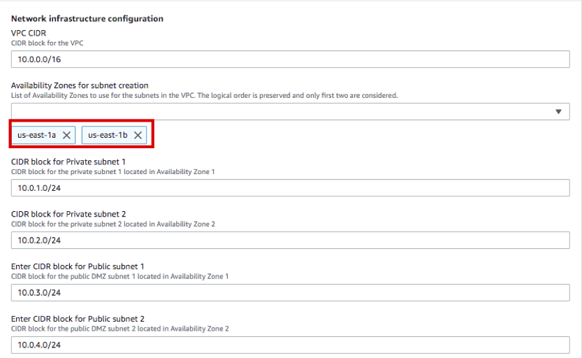

---

title: Task 01. SAP HANA Quick Starts
weight: 20
pre: "<b> </b>"

---

{}
SAP HANA Quick Starts를 이용하여 SAP HANA High Availability Architecture를 손쉽게 구성합니다.
{}

---

#### 사전작업 : Key Pair 생성
HANA Database 및 Application Servers 에 접속하기 위한 Key Pair 를 생성 합니다.

1. AWS Management Console에 로그인 한 뒤 [Key Pairs Console](https://console.aws.amazon.com/ec2/v2/home?region=us-east-1#KeyPairs:) 서비스에 접속합니다.
2. **Create key pair** 버튼을 누릅니다.

3. Name은 **SAP-ImmersionDay-Lab** 라고 입력 후 **Create key pair** 버튼을 누릅니다.

4. 이번 WorkShop은 HANA DB 인스턴스는 Session Manager를 통해 접속하고, Bastion Host(Windows Server 2019)는 key pair를 사용하여 Administrator Password를 복호화 하고 원격 접속 프로그램을 통해 접속할 예정입니다. 다운로드 된 키는 안전한 위치에 보관합니다.(**주의 Lab02에서 사용할 예정입니다.)

---

#### SAP HANA Quick Starts
SAP HANA Quick Starts는 설치를 위한 다양한 옵션이 있습니다. 본 실습은 새로운 VPC에 HANA Database를 Multi-AZ 기반으로 구성합니다. SAP HANA Quick Starts에 대한 자세한 사항은 옆 링크를 참고하시기 바랍니다.([SAP HANA Quick Start Guide](https://docs.aws.amazon.com/quickstart/latest/sap-hana/welcome.html))

1. AWS Management Console에 로그인 한 뒤 [SAP HANA Quick Starts](https://console.aws.amazon.com/cloudformation/home?region=us-east-1#/stacks/create/template?stackName=SAP-HANA-HA&templateURL=https://aws-quickstart.s3.amazonaws.com/quickstart-sap-hana-ha/templates/SAP_HANA_HA_Master_New_VPC.yaml) 서비스에 접속합니다.
2. 리전이 **US East(N.Virginia)** 인지 확인 합니다. 그리고 **Next** 버튼을 선택합니다.

3. Stack name은 이전에 사용했던 name과 동일하지 않는한 변경하지 않습니다.
4. **Step2.Specify stack details** 은 S4HANA 설치를 위한 VPC, SAP HANA, SAP S/4HANA ABAB Cluster 설정 옵션을 입력하는 단계입니다.
5. **Step2.1 Network infrastructure configuration** 옵션은 아래와 같이 입력 합니다.
    * VPC CIDR(default) : 10.0.0.0/16
    * **Availability Zones for subnet creation(선택)** : us-east-1a, us-east-1b
    * CIDR block for Private subnet 1(default) : 10.0.1.0/24
    * CIDR block for Private subnet 2(default) : 10.0.2.0/24
    * Enter CIDR block for Public subnet 1(default) : 10.0.3.0/24
    * Enter CIDR block for Public subnet 2(default) : 10.0.4.0/24
    

6. **Step2.2 Server and storage configuration** 옵션은 아래와 같이 입력 합니다.
    * **Choose operating system for SAP HANA** : SuSELinux12SP4ForSAP-BYOS
    * **Enter SUSE BYOS Registration Code** : XXXXXXXXXXXXXXXX (자신의 Registration code를 입력 합니다)
    * Choose instance type for SAP HANA : r5.4xlarge
    * Enter Dedicated Host ID :
    * **Choose key pair** : SAP-ImmersionDay-Lab
    * Choose storage volume type for SAP HANA Log : gp2
    * Choose storage volume type for SAP HANA Data : gp2
    * Would you like to turn on encryption? : no
    

7. **Step2.3 SAP HANA database configuration** 옵션은 아래와 같이 입력 합니다.
    * Enter domain name : local
    * Enter SAP HANA Primary host name : prihana
    * Enter SAP HANA Secondary host name : sechana
    * Enter SAP HANA system ID : HDB
    * Enter SAP HANA instance number : 00
    * **Enter SAP HANA password** : Init12345!
    * Enter SAP HANA Server timezone : UC
    * **Enter Amazon S3 URL for SAP HANA software** : (e.g s3://sap-immsersionday-hol1/hanadb/)
    * Install SAP HANA software? : Yes
    

8. **Step2.4 SAP HANA High Availability configuration** 옵션은 기본 설정 그대로 사용합니다.
    * HANA Primary Site Name : HAP
    * HANA Secondary Site Name : HAS
    * Overlay IP Address : 192.168.1.99
    * Pacemaker Tag Name : PaceTag
    

9. **Step2.5 Optional configuration** RDP 및 Bastion 설정은 Lab02에서 다룰 예정이므로 변경없이 **No** 로 선택합니다. 나머지 옵션은 Skip 합니다.
    

10. **Step2.6 Advanced configuration (Do not modify unless directed by AWS Support)** 은 Default 설정을 사용합니다 **Next** 버튼을 선택합니다.
    

11. **Step3.Configure stack options** 은 Stack 실행 옵션을 설정하는 단계 입니다.
12. Error 발생 시 원활한 Trouble Shooting을 위해 Rollback 옵션을 **Disabled** 로 변경합니다. 그리고 **Next** 버튼을 선택합니다.
    

13. **Step4.Review** 은 이전 설정을 확인하는 단계 입니다. 제일 하단 **Capabilities** 의 두 체크 Box를 선택 후 **Create stack** 버튼을 선택합니다.
    

14. **SAP-HANA-HA** 스택이 생성 되었습니다. Status가 **CREATE_COMPLETE** 가 될 때 까지 기다립니다.
    
    

{}
***Error 가 발생했을 경우 진행하고 있는 Solutions Architect에게 문의 합니다.***
{}

---

{}
***Lab01 실습이 종료 되었습니다. 다음은 Lab02를 진행합니다.***
{}

---

© 2019 Amazon Web Services, Inc. 또는 자회사, All rights reserved.

