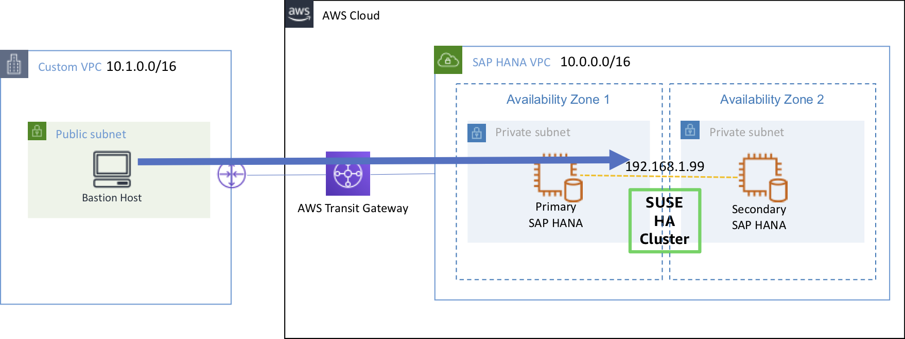

#### Lab 설명

{}
***Lab01에서 구성한 SAP HANA Cluster를 모니터링 하는 방법과, Transit Gateway를 이용하여 OnPrem 및 다른 VPC에서 Overlay IP에 접속하는 방법을 알아 볼 예정입니다.***
{}

---

#### Lab Architecture

---

© 2019 Amazon Web Services, Inc. 또는 자회사, All rights reserved.

