{}
SAP HANA Quick Starts 로 생성된 중요 리소스들을 확인합니다.
{}

1. 생성된 SAP HANA Instance를 확인 합니다. AWS Management Console에 로그인 한 뒤 [EC2 Console](https://console.aws.amazon.com/ec2/v2/home?region=us-east-1#Instances:sort=instanceId)에 접속합니다.
2. HANA DB Primary 와 Secondary 인스턴스가 생성된 것을 확인하실 수 있습니다.
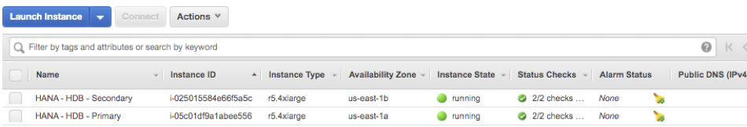
3. HANA DB Primary 또는 Secondary 인스턴스를 선택하고 아래 **Description** 탭을 보면 **Secondary private ip**가 생성된 것을 확인하실 수 있습니다. 이 Secondary IP는 두 노드간 통신하는 데 사용합니다.(다른 노드가 이슈가 있는지 확인하는 용도로 사용)
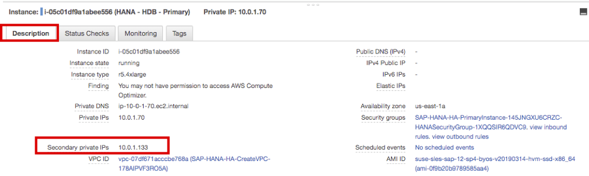
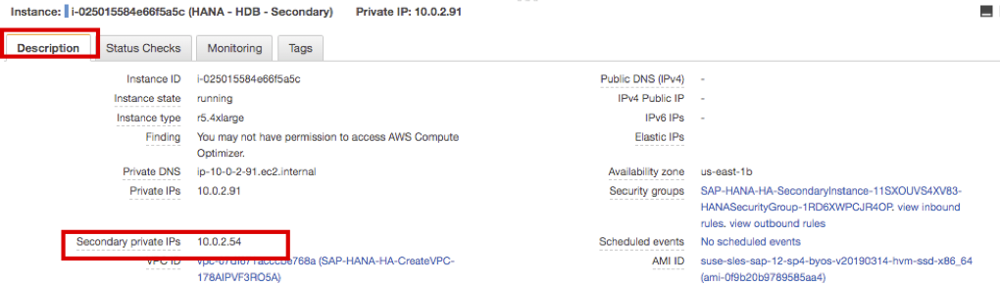
4. HANA DB Primary 또는 Secondary 인스턴스를 선택하고 아래 **Tags** 탭을 보면 **PaceTag**(Quick Starts에서 옵션으로 입력)가 생성된 것을 확인하 실 수 있습니다. EC2 Instance의 Host name은 자동으로 생성성되기 때문에 Cluster agent는 이 태그를 보고 HANA DB Instance를 구분 합니다.
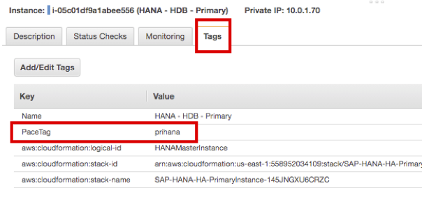
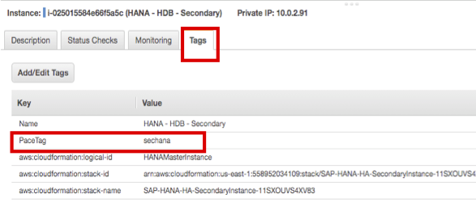
5. HANA DB Primary 또는 Secondary 인스턴스를 선택하고 상단에 있는 **Connect** 버튼을 선택하면 **Session Manager** 통해 인스턴스에 접속 할 수 있습니다.
**Connect** 버튼을 누르면 인스턴스에 접속합니다. Lab03에서는 Session Manager를 통해 인스턴스를 접속하여 HA 테스트를 진행할 예정입니다.
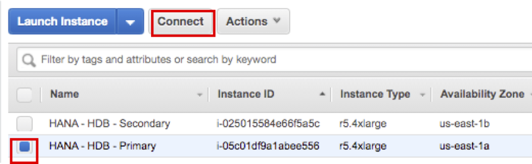
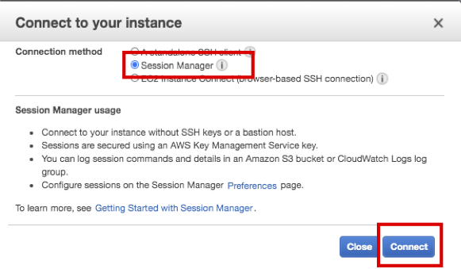
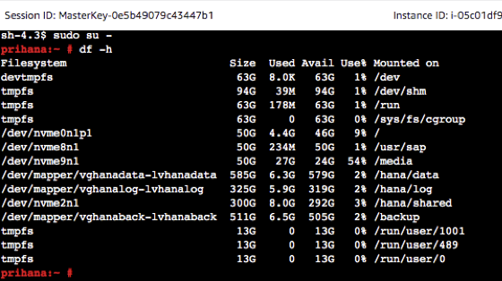

6. 생성된 VPC 및 Subnets 을 확인 합니다. AWS Management Console에 로그인 한 뒤 [Subnets Console](https://console.aws.amazon.com/vpc/home?region=us-east-1#subnets:sort=SubnetId)에 접속합니다.
7. Private 및 Public Subnet이 각각 두개 씩 생성된 것을 확인하실 수 있습니다.  
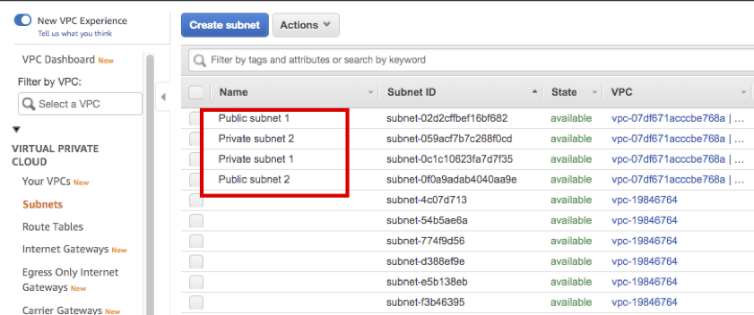
8. 좌 측에 **Route Tables** 메뉴를 확인하시면. Public 및 Private Subnet에 대한 라우팅을 확인하실 수 있습니다.
9. **Private subnet route table** 을 선택하고 아래 **Routes** 탭을 확인하시면 **Overlay IP**(아래 Connect to Overlay IP 설명 참고)에 대한 라우팅 엔트리를 확인 하실 수 있습니다. Target에 정의 되어 있는 eni를 클릭 하면 현재 Primary DB와 연결되어 있는것을 확인 하실 수 있습니다.(* 참고: 사용자 마다 private ip는 다릅니다.)
    * Lab03에서 Secondary DB로 take over 된 이후에 Route Table이 어떻게 변경되는지 확인해 보시기 바랍니다.  
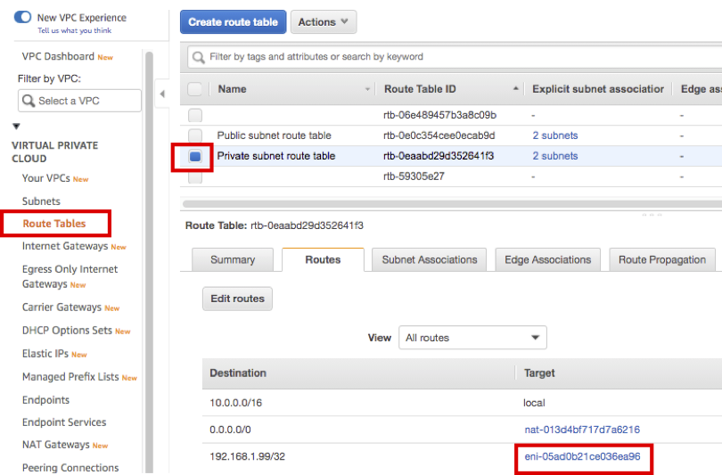
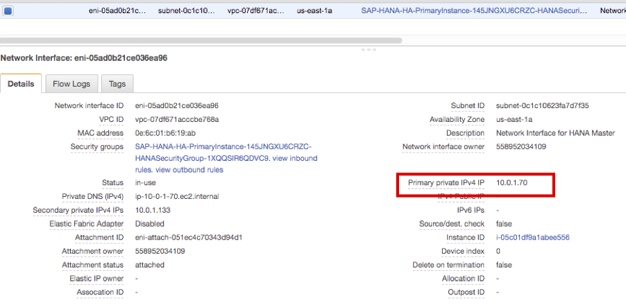

---

© 2019 Amazon Web Services, Inc. 또는 자회사, All rights reserved.

