{}
Multi AZ 환경에서 High Availability Cluster를 구성하게 될 경우, Application Server 및 HANA Database 가 사용하는 VIP는 VPC CIDR 밖에 있는 Overlay IP를 사용합니다. 이것을 다른 VPC 혹은 OnPremise 환경에서 접속하기 위해서는 구성한 리전에 Transit Gateway를 구성하여, VPC 및 VPN/Direct Connect 를 연결하고, Overlay IP를 라우팅 테이블에 등록해야 합니다. 이번 실습에서는 CloudFormation을 통해 가상의 Custom VPC 환경을 만들고, Bastion Host가 Overlay IP를 통해 HANA Database에 연결하는 실습을 진행할 예정입니다.
{}

이번 Task는 총 5 단계로 진행 됩니다.
  * Customer VPC 및 Bastion Host 생성
  * Transit Gateway 생성 및 설정
  * Instance route table 업데이트
  * Instance Security Group 업데이트
  * Bastion Host와 Overlay IP 연결 테스트

---

#### Customer VPC 및 Bastion Host 생성
CloudFormation으로 Custom VPC 및 Bastion Host를 생성합니다.

1. AWS Management Console에 로그인 한 뒤 [CloudFormation for Customer VPC](https://us-east-1.console.aws.amazon.com/cloudformation/home?region=us-east-1#/stacks/quickcreate?templateURL=https://cloudformation-template-sejun.s3.ap-northeast-2.amazonaws.com/SAPHANAonAWSAdvanced.yaml&stackName=CustomVPC) 에 접속합니다.
2. **Network Configuration** 설정은 기존과 겹치지 않으면 기본 설정을 사용합니다.
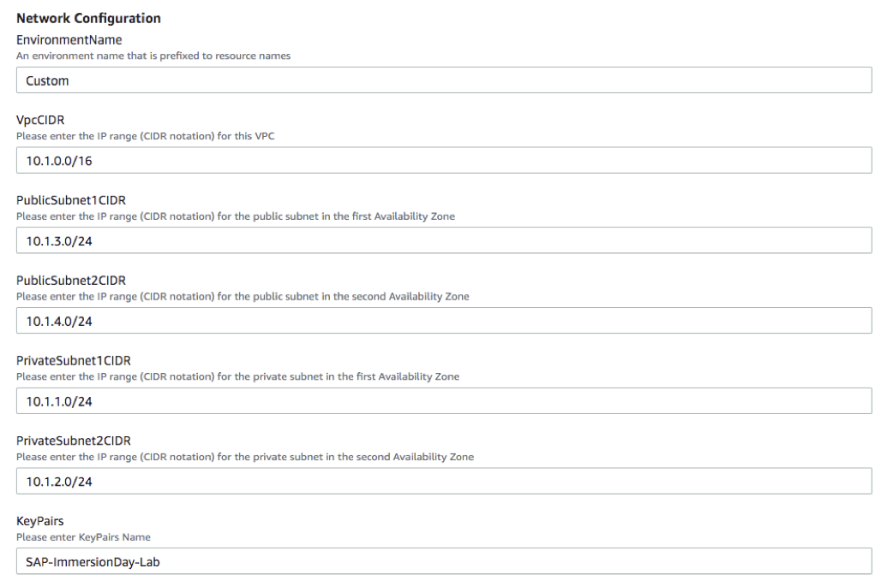
3. 화면 아래 **Capabilities** 의 두개의 체크박스를 선택하고 **Create stack** 버튼을 누릅니다.
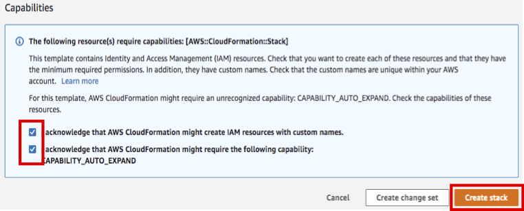
4. **CustomVPC** 스택이 생성되었습니다. Status가 **CREATE_COMPLTE** 될 때까지 기다립니다.

5. [EC2 Instance Console](https://console.aws.amazon.com/ec2/v2/home?region=us-east-1#Instances:sort=instanceId)에 접속 합니다. Bastion Host(Windows Sever 2019)가 Custom VPC - Public Subnet 위에 생성된 것을 확인 하실 수 있습니다.
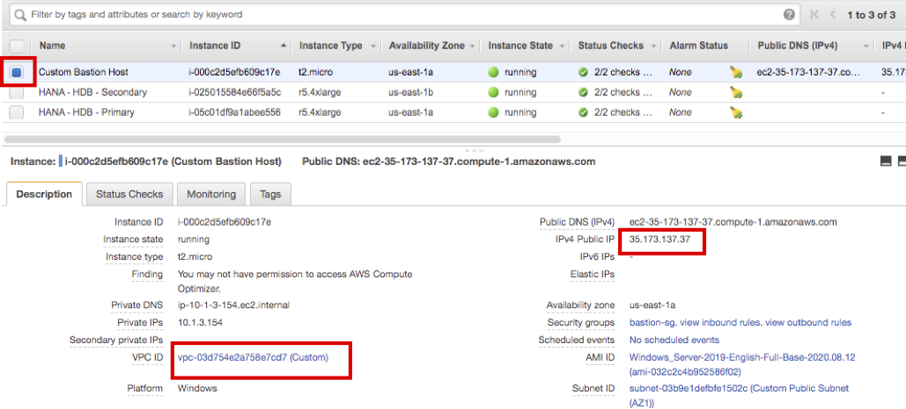

---

#### Transit Gateway 생성 및 설정
SAP HANA VPC 및 Custom VPC를 연결하기 위해 Transit Gateway를 생성합니다.

1. [Transit Gateways Console](https://console.aws.amazon.com/vpc/home?region=us-east-1#TransitGateways:sort=transitGatewayId)에 접속하여 Transit Gateway를 생성하고 HANA DB 인스턴스의 VPC와 Custom VPC를 연결합니다. 그리고 Overlay IP를 연결하기 위한 엔트리를 해당 Transit Gateway의 Routing Table에 등록합니다.
2. **Create Transit Gateway** 버튼을 누릅니다.
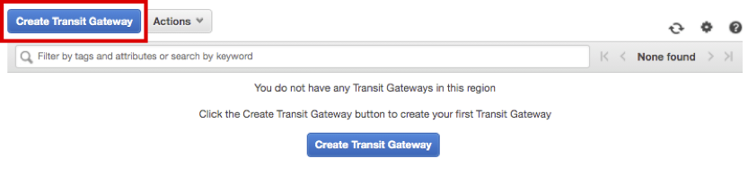
3. Name Tag에 **HANA-TGW** 로 입력하고 **Create Transit Gateway** 버튼을 누릅니다. **Close** 버튼을 누릅니다.
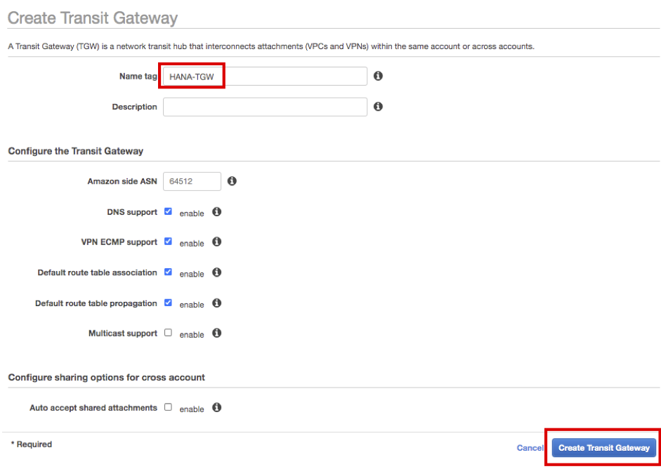
4. 방금 생성한 **HANA-TGW** State가 **available** 이 될때까지 기다립니다.
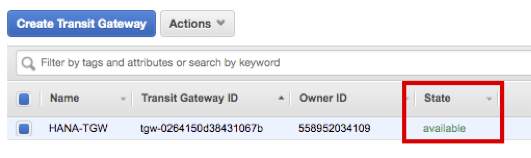
5. [Transit Gateways Attachment Console](https://console.aws.amazon.com/vpc/home?region=us-east-1#TransitGatewayAttachments:sort=transitGatewayAttachmentId)에 하여 HANA VPC와, Custom VPC를 연결 합니다. **Create Transit Gateway Attachment** 버튼을 선택 합니다.
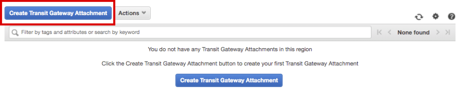
6. 이전에 생성한 **HANA-TGW** 를 선택하고, Attachment name tag는 **HANA VPC** 를 입력합니다. VPC ID는 **SAP-HANA~** 로 시작하는 것을 선택합니다.
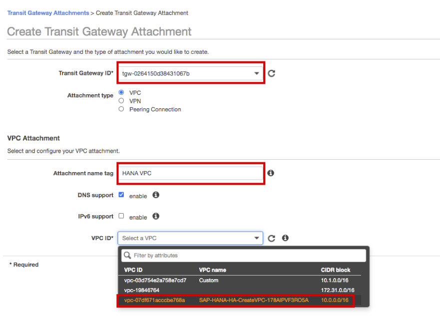
7. Subnet ID를 **Private Subnet 1,2** 로 선택하고,우측 하단에 있는 **Create attachment** 버튼을 누릅니다. **Close** 버튼을 누릅니다.
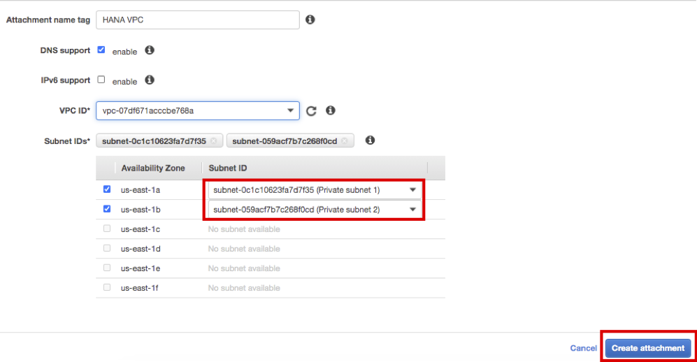
8. 다시 **Create Transit Gateway Attachment** 버튼을 누릅니다.
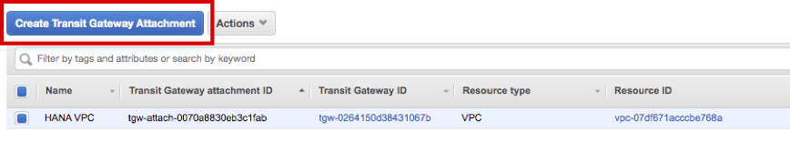
9. 마찬가지로 **HANA-TGW** 를 선택하고, Attachment name tag는 **Custom VPC** 를 입력합니다. VPC ID는 **Custom** 을 선택합니다.
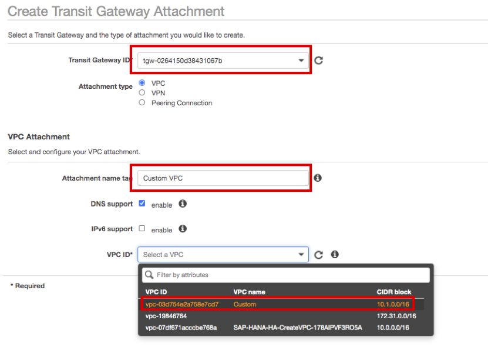
10. Subnet ID를 **Custom Public Subnet AZ1, AZ2** 로 선택하고, 우측 하단에 있는 **Create attachment** 버튼을 누릅니다. **Close** 버튼을 누릅니다.
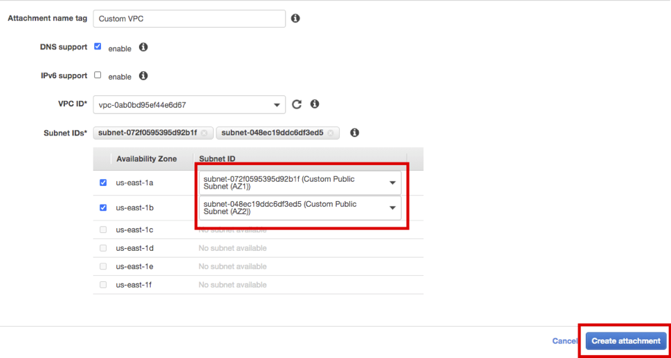
11. 두 연결이 모두 **State** 가 **available** 이 될 때까지 기다립니다.(일정 시간 후 Refresh 버튼을 눌러서 State를 확인합니다.)
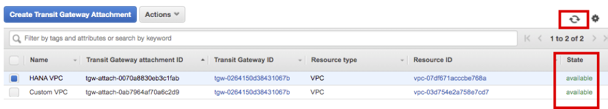

12. [Transit Gateways Route Tables Console](https://console.aws.amazon.com/vpc/home?region=us-east-1#TransitGatewayRouteTables:sort=transitGatewayRouteTableId)에 접속하여 Overlay IP에 대한 라우팅을 등록 합니다.
13. 생성된 라우팅 테이블을 선택하고 아래에 **Routes** 탭을 선택합니다. **Create static route** 버튼을 선택 합니다.
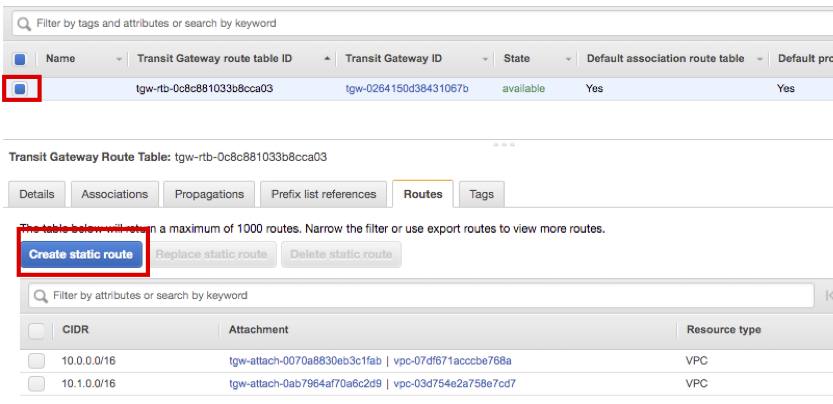
14. CIDR은 **192.168.1.99/32** 를 입력 합니다.
15. Choose attachment는 **HANA VPC** 를 선택하고, **Create static route** 버튼을 누릅니다.
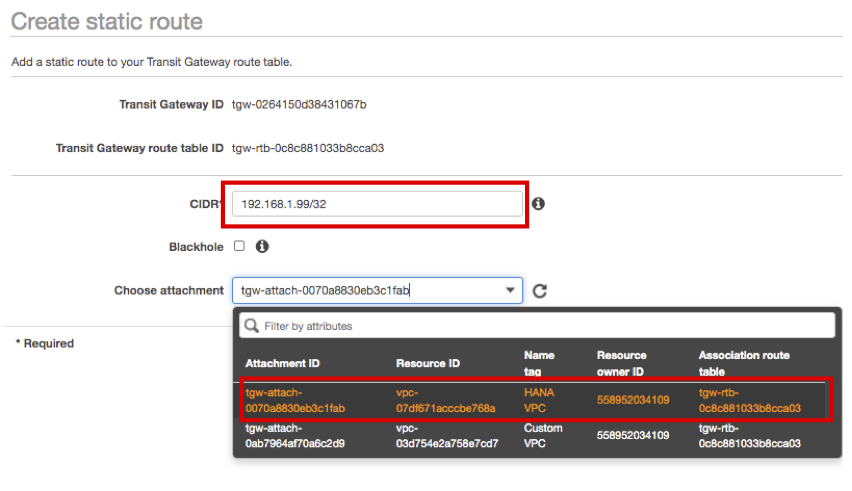
16. **Close** 버튼을 누릅니다.
17. Overlay IP에 대한 static route가 등록 된것을 확인하실 수 있습니다.
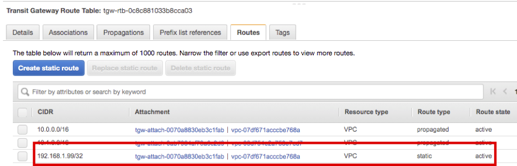

---

#### Instance route table 업데이트
HANA DB Instance 와 Bastion Host가 Transit Gateway를 통해 서로 통신할 수 있도록, 각각의 route table을 업데이트 해줍니다.

1. [Route Tables Console](https://console.aws.amazon.com/vpc/home?region=us-east-1#RouteTables:sort=routeTableId)에 접속합니다.
2. HANA DB Instance 의 route table 부터 업데이트 합니다. **Private subnet route table** 를 선택하고 아래 **Routes** 탭을 선택합니다. 다음은 **Edit routes** 버튼을 선택합니다.
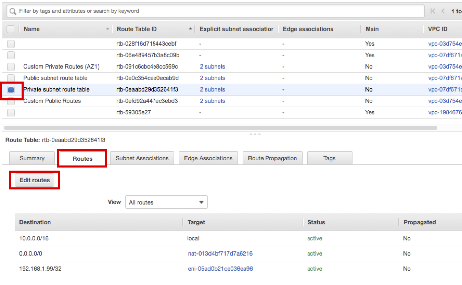
3. **Add routes** 버튼을 선택한 다음, Destination을 **10.1.0.0/16** 로 입력하고, Target을 **Transit Gateway** 로 선택합니다.
4. **HANA-TGW** 를 선택하고 **Save routes** 버튼을 선택합니다.
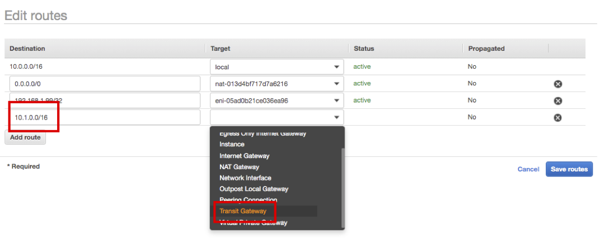
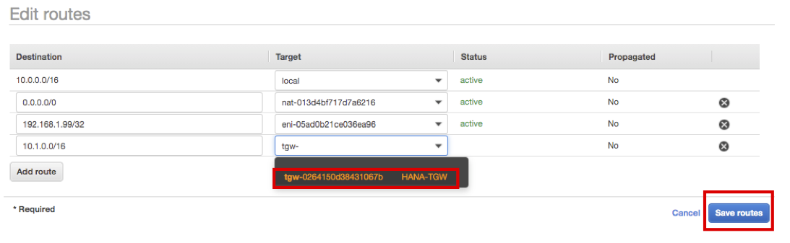
5. **Close** 버튼을 선택합니다.
6. 다음은 Bastion Host의 route table을 업데이트 합니다. **Custom Public Routes** 를 선택하고 아래 **Routes** 탭을 선택합니다. 다음은 **Edit routes** 버튼을 선택합니다.
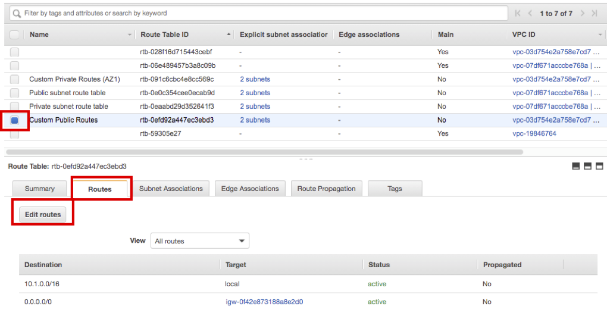
7. **Add routes** 버튼을 선택한 다음, Destination을 **10.0.0.0/16** 로 입력하고, Target을 **Transit Gateway** 로 선택합니다. 다음은 **HANA-TGW** 를 선택합니다.
8. 다시 **Add routes** 버튼을 선택한 다음, Destination을 **192.168.1.99/32** 로 입력하고, Target을 **Transit Gateway** 로 선택합니다. 다음은 **HANA-TGW** 를 선택합니다.
9. 두 routes 가 등록된 것을 확인하고 **Save routes** 버튼을 선택합니다.
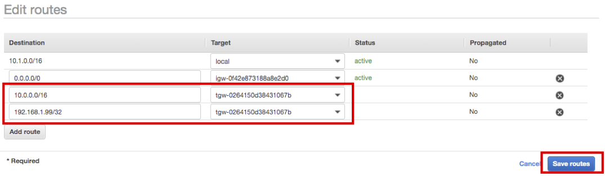
10. **Close** 버튼을 누릅니다.

---

#### Instance Security Group 업데이트
Primary 및 Secondary HANA DB 인스턴스의 Security Group에 Bastion Host에 대한 인바운트 트래픽을 허용해 줍니다.

1. 우선 Bastion Host의 IP를 확인 합니다. [EC2 Instance Console](https://console.aws.amazon.com/ec2/v2/home?region=us-east-1#Instances:sort=instanceId)에 접속 합니다. **Custom Bastion Host** 의 Private IP를 확인 합니다. (e.g 10.1.3.154)
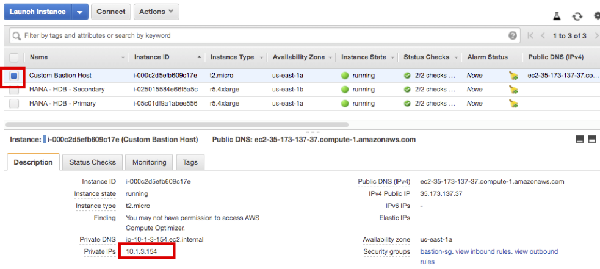
2. Primary 인스턴스 부터 업데이트 합니다. **HANA-HDB-Primary** 인스턴스를 선택하고, 아래 Security Groups 링크를 클릭 합니다.
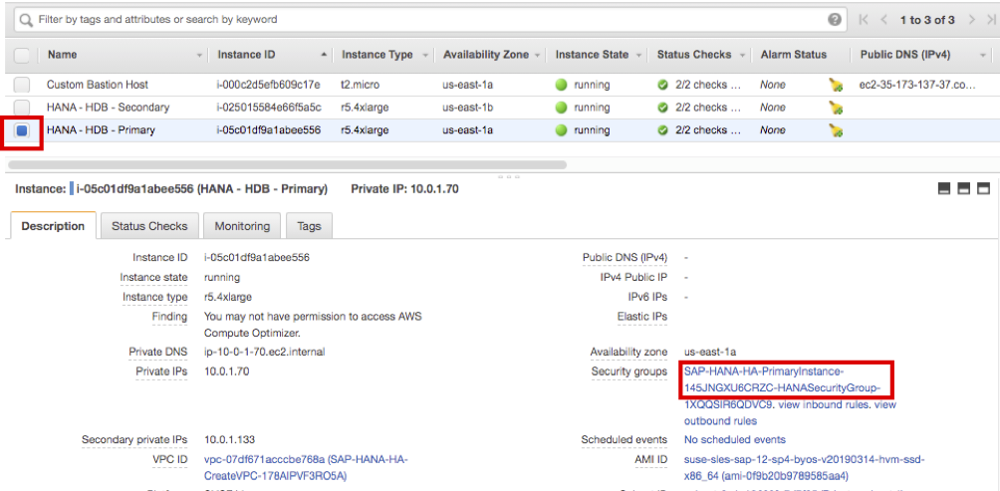
3. 하단의 **Inbound rules** 탭을 선택하고, **Edit inbound rules** 버튼을 선택합니다.
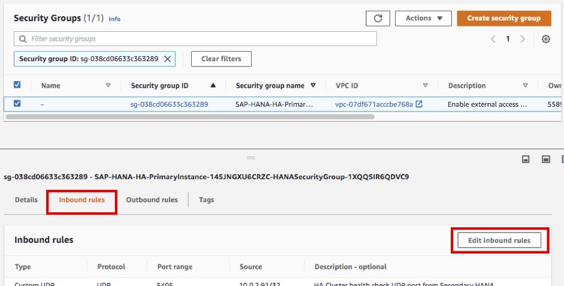
4. 제일 아래 **Add rule** 버튼을 선택하고, Type은 **All traffic** 를 선택하고 Source는 위에서 찾은 Bastion Host의 CIDR을 입력해 줍니다. (e.g 10.1.3.154/32)
    * 실습 환경이기 때문에, Bastion Host를 All traffic 으로 허용 하였습니다. 실제 환경에서는 필요한 포트만 허용 해주는 것을 권장 드립니다.
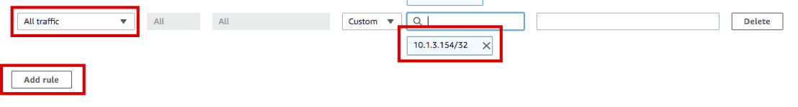
5. 제일 아래 **Save rules** 버튼을 선택합니다.
6. Primary Instance와 동일하게 Secondary Instance에 Security Group에도 업데이트 합니다. 다시 [EC2 Instance Console](https://console.aws.amazon.com/ec2/v2/home?region=us-east-1#Instances:sort=instanceId)에 접속 합니다.
7. **HANA-HDB-Secondary** 인스턴스를 선택하고, 아래 Security Groups 링크를 클릭 합니다.
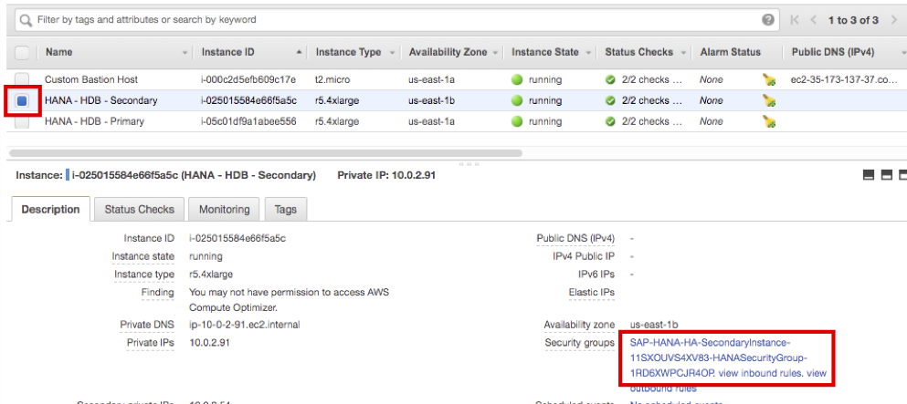
8. 하단의 **Inbound rules** 탭을 선택하고, **Edit inbound rules** 버튼을 선택합니다.
9. 제일 아래 **Add rule** 버튼을 선택하고, Type은 **All traffic** 를 선택하고 Source는 위에서 찾은 Bastion Host의 CIDR을 입력해 줍니다. (e.g 10.1.3.154/32)
    * 실습 환경이기 때문에, Bastion Host를 All traffic 으로 허용 하였습니다. 실제 환경에서는 필요한 포트만 허용 해주는 것을 권장 드립니다.

10. 제일 아래 **Save rules** 버튼을 선택합니다.

---

#### Bastion Host와 Overlay IP 연결 테스트
Bastion Host에 접속해서 Overlay IP와 연결 가능한지 확인하기 위해 Ping 테스트를 수행 합니다.

1. [EC2 Instance Console](https://console.aws.amazon.com/ec2/v2/home?region=us-east-1#Instances:sort=instanceId)에 접속 합니다.**Custom Bastion Host** 의 Public IP를 확인 합니다. (e.g 35.173.137.37)
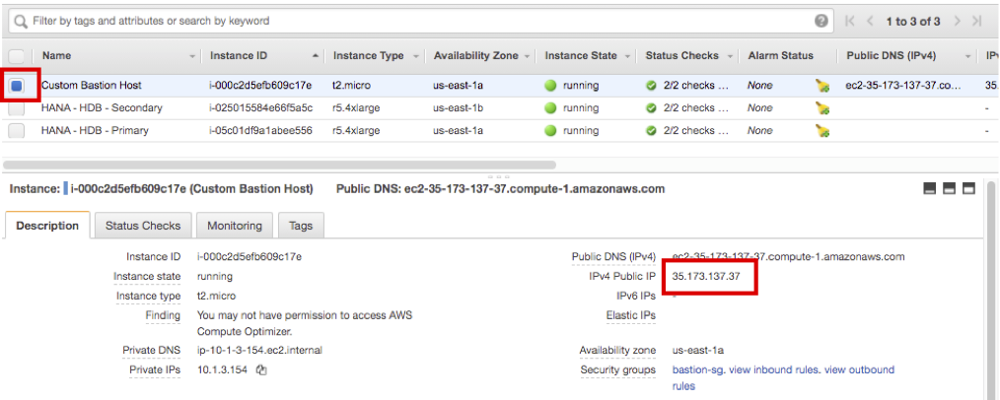
2. **Custom Bastion Host** 를 선택하고 **Connect** 버튼을 누릅니다.
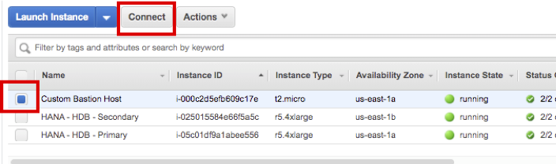
3. **Get Password** 를 선택 합니다.
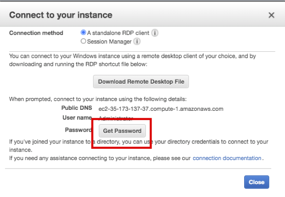
4. **파일 선택** 버튼을 선택하고, Lab01에서 저장한 **SAP-ImmersionDay-Lab.pem** 파일을 선택 합니다.
    * OS에 따라 아래 화면이 다르게 보일 수 있습니다. 아래 캡처 화면은 MacBook 화면 입니다.
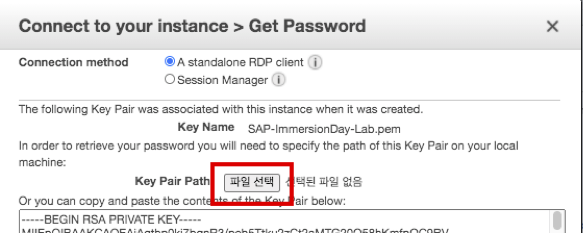
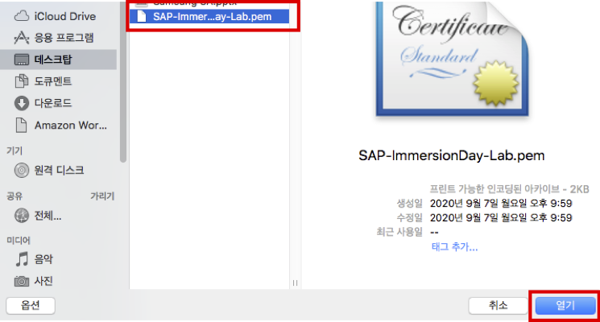
5. **Decrypt Password** 버튼을 선택해서, Administrator Password를 확인 합니다.(e.g qRPIUIXXSI5ceUhLuntol%WhZ&WFzCT$)
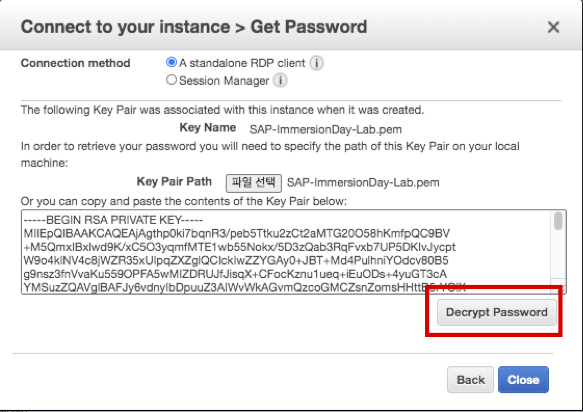
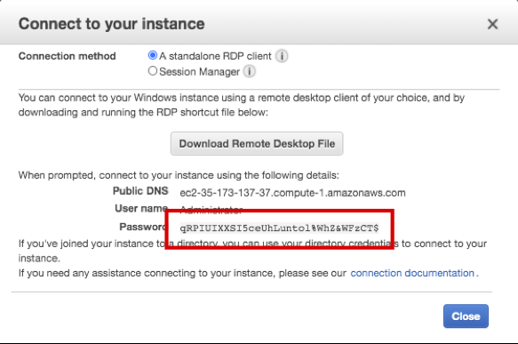
6. **Close** 버튼을 누릅니다.
7. 원격접속 프로그램을 사용하여 Bastion Host에 접속합니다.
    * [Windows OS에서 원격 접속방법 참고](https://www.soft2000.com/12664)
    * [MAC OS에서 원격 접속방법 참고](https://kimsungjin.tistory.com/227)
8. 성공적으로 접속이 되면, Search 창에서 **Windows PowerShell**을 검색하고, 실행합니다.
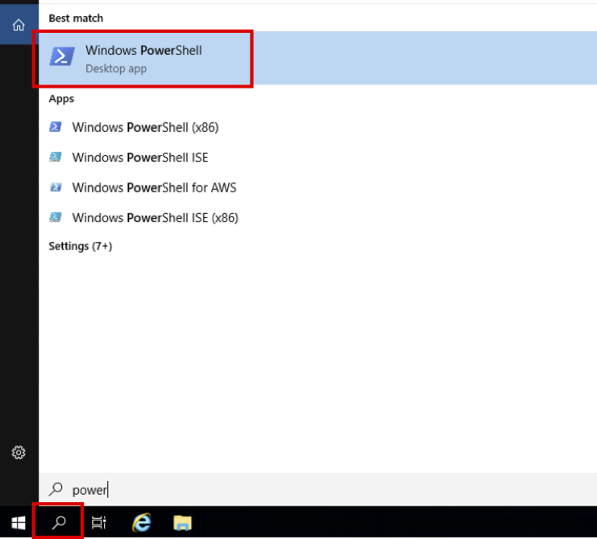
9. PowerShell이 실행되면 Overlay IP와 통신이 되는지 확인하기 위해 **ping 192.168.1.99** 를 실행 합니다.
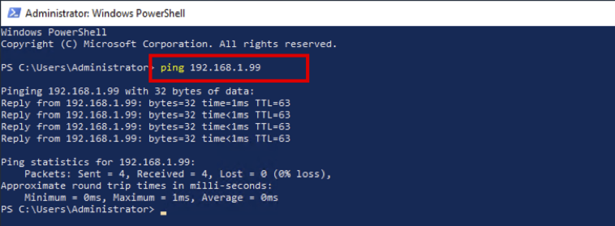

{}
***PowerShell은 종료하고, 원격접속을 유지한 상태로 Task03을 진행합니다.***
{}
---

© 2019 Amazon Web Services, Inc. 또는 자회사, All rights reserved.

