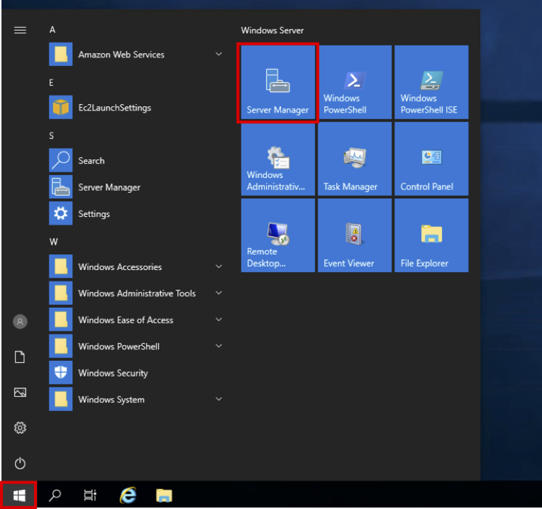
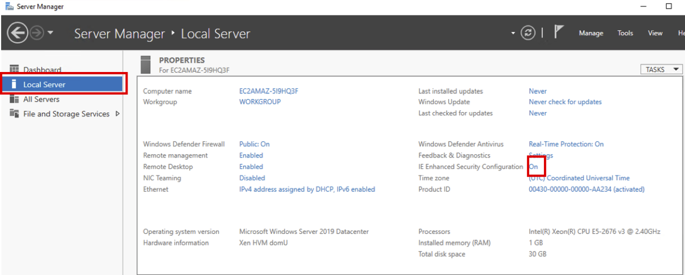
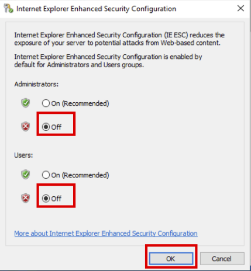
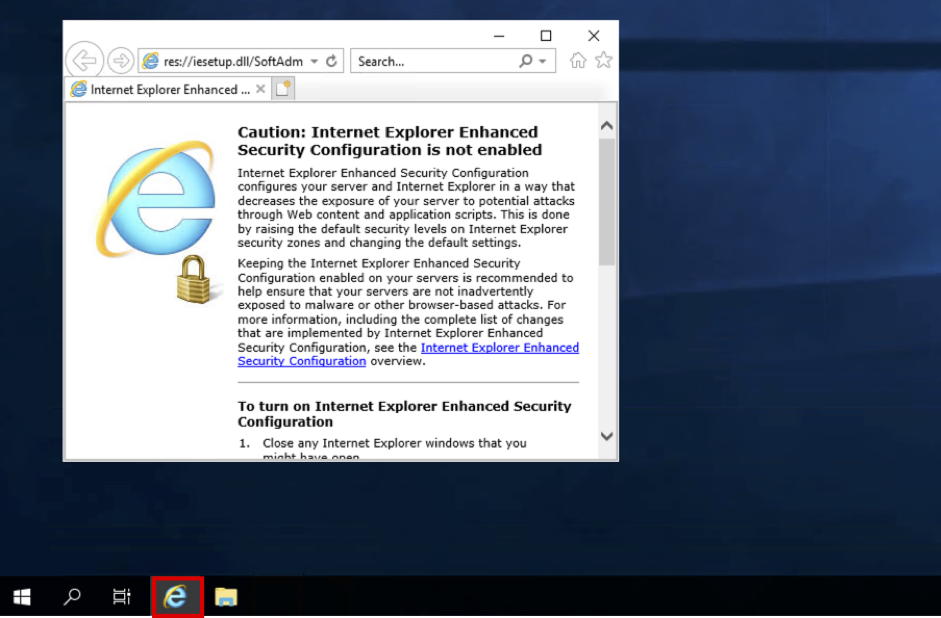
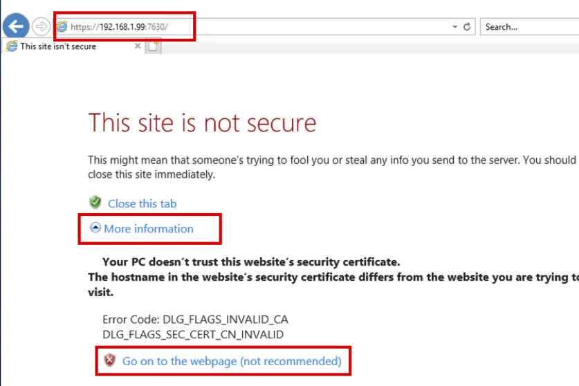
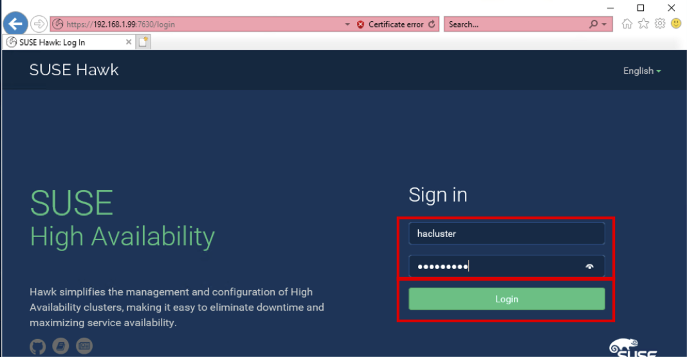
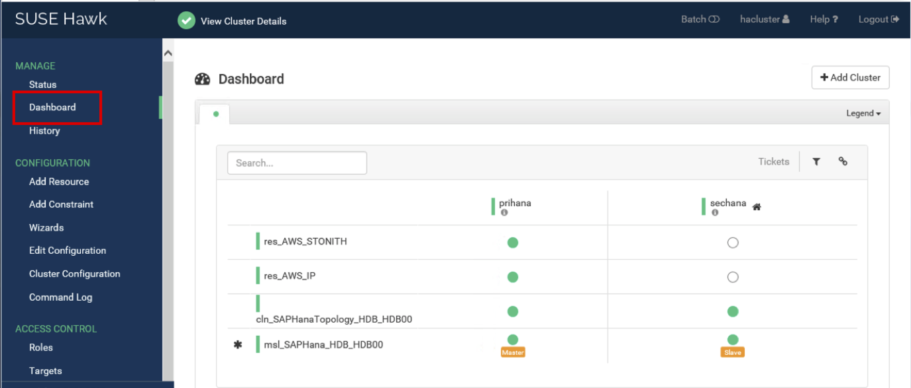

{}
HAWK(High Availability Web Konsole)에 접속하여 HANA DB의 Cluster 상태를  Web 화면으로 확인하실 수 있습니다.
{}

1. 원격접속 프로그램을 사용하여 Bastion Host(Windows Server 2019)에 접속합니다.
    * IP와 Administrator의 Password 확인 방법은 Task02를 참고 합니다.
    * [Windows OS에서 원격 접속방법 참고](https://www.soft2000.com/12664)
    * [MAC OS에서 원격 접속방법 참고](https://kimsungjin.tistory.com/227)
2. Windows 버튼을 누르고, **Server Manager** 에 접속합니다.

3. Internet Explorer의 보안 설정을 해제하기 위해 **Local Server** 를 선택하고, **IE Enhanced Security Configuration** 의 **On** 을 선택합니다.

4. Administrator와 Users를 모두 **Off** 로 변경한 후 **OK** 버튼을 선택합니다.

5. Server Manager를 종료합니다. 그리고 Internet Explorer 를 실행합니다.

6. 주소창에 "https://192.168.1.99:7630" 을 입력합니다. (IP: Overlay IP, Port: 7630)
7. **More information** 을 선택하고 **Go on to the webpage** 를  선택합니다.

8. HAWK Login 페이지가 로딩 됩니다. ID: **hacluster** , Password: **Init12345!** 로 입력합니다. (Password는 Lab01의 Quick Starts 옵션에서 SAP HANA password로 입력하였습니다.) **Login** 버튼을 누릅니다.

9. **Dashboad** 메뉴를 선택합니다. 현재 각 노드의 상태와 노드 별 리소스 상태를 확인하실 수 있습니다.

{}
***원격접속을 유지한 상태로 Lab03을 진행합니다. HA Test시에 Dashboard 상태를 확인할 예정입니다.***
{}

---

{}
***Lab02 실습이 종료 되었습니다. 다음은 Lab03을 진행합니다.***
{}

---

© 2019 Amazon Web Services, Inc. 또는 자회사, All rights reserved.

