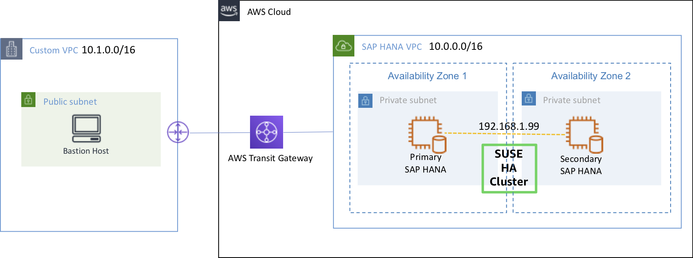

#### Lab 설명

{}
***Lab01에서 구성한 SAP HANA Cluster가 테스트 사례에서 정상 동작 하는지 확인하는 방법을 배워 볼 예정입니다.***
{}

---

#### Lab Architecture

이번 실습에서는 아래 세가지 사례에 대한 테스트를 진행할 예정입니다. 각각의 사례에서 DB가 정상적으로 테이크 오버 되느는지 확인하는 방법을 배울 예정입니다.
  * Test Case 01: Stop Database(Primary <--> Secondary)
  * Test Case 02: Crash Database(Primary <--> Secondary)
  * Test Case 03: System crash(Primary <--> Secondary)

1. Test Architecture

2. Secondary(on sechana) to take over as Primary

2. Secondary(on prihana) to fail back as Primary

---

© 2019 Amazon Web Services, Inc. 또는 자회사, All rights reserved.

