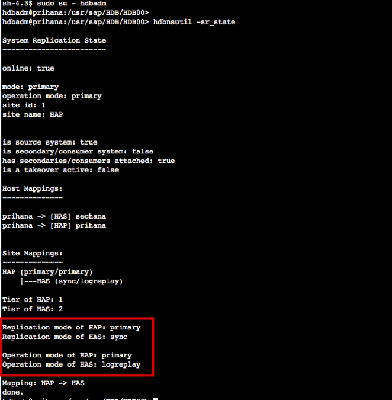
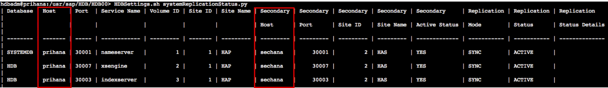
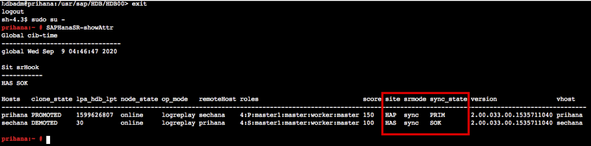

{}
Task 01은 HA 테스트를 진행하기 전에 클러스터가 정상 상태인지 확인합니다. 인스턴스는 Session Manager를 통해 접속할 예정입니다.
{}

---

1. AWS Management Console에 로그인 한 뒤 [EC2 Instance Console](https://console.aws.amazon.com/ec2/v2/home?region=us-east-1#Instances:sort=instanceId)에 접속 합니다.
2. **HANA-HDB-Primary** 인스턴스를 선택하고, **Connect** 버튼을 누릅니다.

3. **Session Manager** 를 선택하고, **Connect** 버튼을 누릅니다. Session Manager를 통해 **prihana** 인스턴스에 접속합니다.

4. SAP HANA System Replication (HSR) 상태 체크를 합니다.
  * **hdbnsutil -sr_state** 명령어를 사용하여 상태 체크(hdbadm<sidadm> 유저사용)
    * **HAP(prihana)** site가 Primary 이고 **HAS(sechana)** site가 sync 상태인것을 확인 할 수 있습니다.
    ```shell
    sudo su - hdbadm
    hdbnsutil -sr_state
    ```
    
  * **HDBSettings.sh systemReplicationStatus.py** 명령어를 사용하여 상태 체크(hdbadm<sidadm> 유저사용)
    * Primary node가 **prihana** 이고 Secondary node가 **sechana** 인것을 알 수 있습니다.
    ```shell
    HDBSettings.sh systemReplicationStatus.py
    ```
    
  * **SAPHanaSR-showAttr** 사용하여 **sechana** node가 **SOK** 확인 합니다.(root 유저사용)
  ```shell
  exit
  sudo su -
  SAPHanaSR-showAttr
  ```
  
5. Cluster 설정을 확인 합니다.
  * **crm** tool은 cluster 설정 및 관리 하는 툴입니다.
  * HA 동작 방식 확인 하려면, **PREFER_SITE_TAKEOVER="true"** 및 **AUTOMATED_REGISTER="true"** 두가지 옵션을 확인 홥니다. 둘 다 **true** 일 경우 Takeover가 자동으로 수행 되고 Secondary로 전환된 노드가 정상일 경우 자동으로 등록된다는 의미 입니다.
  * **crm configure show** 명령어를 사용하여 상태 체크(root 유저사용)
  ```shell
  crm configure show
  ```
  
6. Cluster 상태를 확인 합니다.
  * **crm_mon** 은 Cluster의 현재 상태를 제공하는 명령어 입니다.(root 유저사용)
  * 아래 명령어를 수행하여 **prihana** 가 **Master** 상태인지 확인 합니다.
  ```shell
  crm_mon -rfn1
  ```
  

---
<p align="center">
© 2019 Amazon Web Services, Inc. 또는 자회사, All rights reserved.
</p>
