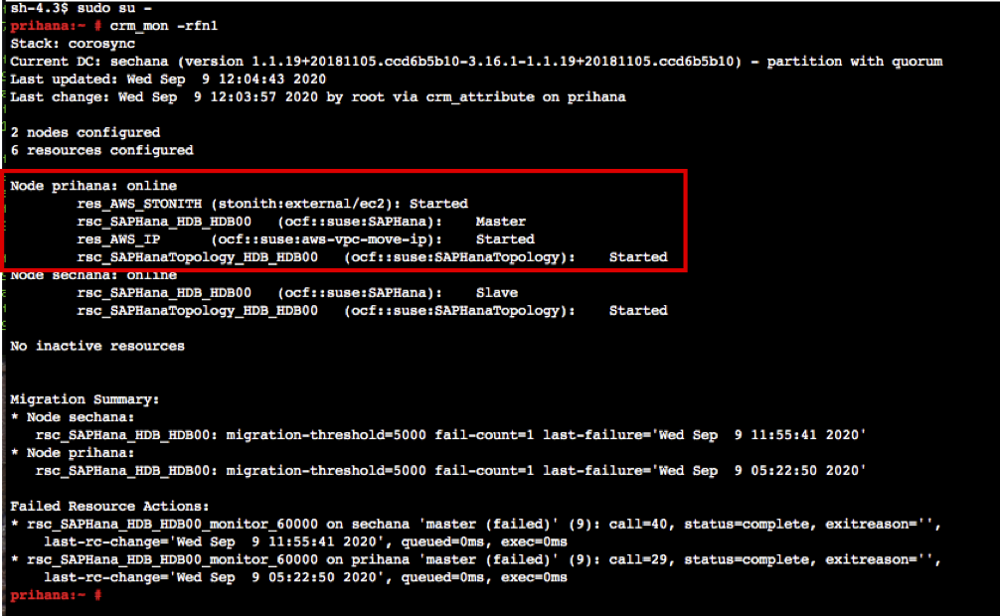

{}
Task 02는 클러스터 작업 중에 HANA 데이터베이스가 중지되는 상황에서 클러스터가 어떻게 동작 하는지 배워볼 예정 입니다.
{}

---

### Stop Primary Database on prihana
Primary node인 **prihana** 에서 HDB STOP이 발생 했을 때, Secondary node **sechana** 노드가 Primary node로 정상적으로 전환되는지 확인.


1. [EC2 Instance Console](https://console.aws.amazon.com/ec2/v2/home?region=us-east-1#Instances:sort=instanceId)에 접속 합니다.
2. **HANA-HDB-Primary** 인스턴스를 선택하고, **Connect** 버튼을 누릅니다.
    
3. **Session Manager** 를 선택하고, **Connect** 버튼을 누릅니다. Session Manager를 통해 **prihana** 인스턴스에 접속합니다.
    
4. **prihana** 에 HANA DB를 중지 합니다.(hdbadm<sidadm> 유저사용)
    ```shell
    sudo su - hdbadm
    HDB stop
    ```
    

5. **sechana** 에 들어가서 Cluster 및 HSR 상태를 확인합니다.
6. [EC2 Instance Console](https://console.aws.amazon.com/ec2/v2/home?region=us-east-1#Instances:sort=instanceId)에 접속 합니다.
7. **HANA-HDB-Secondary** 인스턴스를 선택하고, **Connect** 버튼을 누릅니다.
    
8. **Session Manager** 를 선택하고, **Connect** 버튼을 누릅니다. Session Manager를 통해 **sechana** 인스턴스에 접속합니다.
    

9. Cluster의 상태를 체크 합니다.
    * **crm_mon** 은 Cluster의 현재 상태를 제공하는 명령어 입니다.(root 유저사용)
    * 아래 명령어를 수행하여 **sechana** 가 **Master** 상태인지 확인 합니다.
    ```shell
    sudo su -
    crm_mon -rfn1
    ```
    
10. SAP HANA System Replication (HSR) 상태 체크를 합니다.
    * **SAPHanaSR-showAttr** 사용하여 **prihana** node가 **SOK** 확인 합니다.(root 유저사용)
    ```shell
    SAPHanaSR-showAttr
    ```
    

11. Take over 후 resource 상태를 cleaned up 해줍니다.(root 유저사용)
    ```shell
    crm resource cleanup rsc_SAPHanaTopology_HDB_HDB00
    ```
    

12. Bastion Host에 접속해서 HAWK 웹의 Dashboard를 확인합니다(Lab02 참고)
    * Overlay IP Resource가 sechana로 넘어 간것을 확인하실 수 있습니다.
    

---

### Stop Primary Database on sechana
Primary node인 **sechana** 에서 HDB STOP이 발생 했을 때, Secondary node **prihana** 노드가 Primary node로 정상적으로 전환되는지 확인.


1. [EC2 Instance Console](https://console.aws.amazon.com/ec2/v2/home?region=us-east-1#Instances:sort=instanceId)에 접속 합니다.
2. **HANA-HDB-Secondary** 인스턴스를 선택하고, **Connect** 버튼을 누릅니다.
    
3. **Session Manager** 를 선택하고, **Connect** 버튼을 누릅니다. Session Manager를 통해 **sechana** 인스턴스에 접속합니다.
    
4. **sechana** 에 HANA DB를 중지 합니다.(hdbadm<sidadm> 유저사용)
    ```shell
    sudo su - hdbadm
    HDB stop
    ```
    

5. **prihana** 에 들어가서 Cluster 및 HSR 상태를 확인합니다.
6. [EC2 Instance Console](https://console.aws.amazon.com/ec2/v2/home?region=us-east-1#Instances:sort=instanceId)에 접속 합니다.
7. **HANA-HDB-Primary** 인스턴스를 선택하고, **Connect** 버튼을 누릅니다.
    
8. **Session Manager** 를 선택하고, **Connect** 버튼을 누릅니다. Session Manager를 통해 **prihana** 인스턴스에 접속합니다.
    
9. Cluster의 상태를 체크 합니다.
    * **crm_mon** 은 Cluster의 현재 상태를 제공하는 명령어 입니다.(root 유저사용)
    * 아래 명령어를 수행하여 **prihana** 가 **Master** 상태인지 확인 합니다.
    ```shell
    sudo su -
    crm_mon -rfn1
    ```
    
10. SAP HANA System Replication (HSR) 상태 체크를 합니다.
    * **SAPHanaSR-showAttr** 사용하여 **sechana** node가 **SOK** 확인 합니다.(root 유저사용)
    ```shell
    SAPHanaSR-showAttr
    ```
    
11. Take over 후 resource 상태를 cleaned up 해줍니다.(root 유저사용)
    ```shell
    crm resource cleanup rsc_SAPHanaTopology_HDB_HDB00
    ```
    
12. Bastion Host에 접속해서 HAWK 웹의 Dashboard를 확인합니다(Lab02 참고)
    * **Overlay IP** Resource가 **prihana**로 넘어 간것을 확인하실 수 있습니다.
    

---
<p align="center">
© 2019 Amazon Web Services, Inc. 또는 자회사, All rights reserved.
</p>
