{}
Task 04는 HANA 데이터베이스가 사용하는 OS가 Crash가 발생했을 경우 클러스터가 어떻게 동작 하는지 배워볼 예정 입니다.
{}

---

### Crash Primary Site Node(prihana)
Primary node인 **prihana** 에서 System Crash가 발생 했을 때, Secondary node **sechana** 노드가 Primary node로 정상적으로 전환되는지 확인.
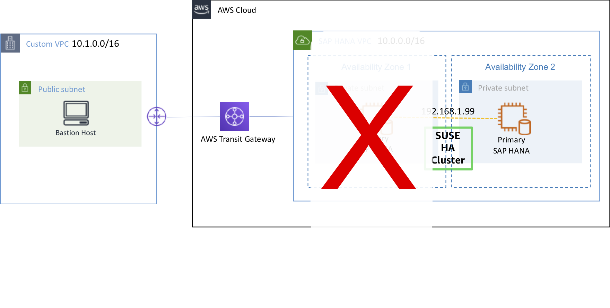

1. [EC2 Instance Console](https://console.aws.amazon.com/ec2/v2/home?region=us-east-1#Instances:sort=instanceId)에 접속 합니다.
2. **HANA-HDB-Primary** 인스턴스를 선택하고, **Connect** 버튼을 누릅니다.
    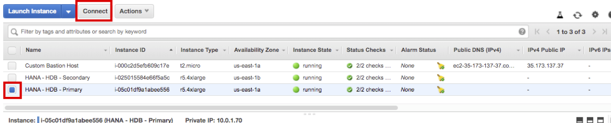
3. **Session Manager** 를 선택하고, **Connect** 버튼을 누릅니다. Session Manager를 통해 **prihana** 인스턴스에 접속합니다.
    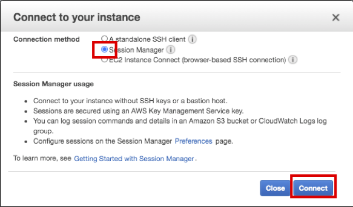
4. **prihana** 에서 fast-reboot을 수행합니다.(root 유저사용)
    ```shell
    sudo su -
    echo 'b' > /proc/sysrq-trigger
    ```
    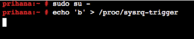

5. **sechana** 에 들어가서 Cluster 및 HSR 상태를 확인합니다.
6. [EC2 Instance Console](https://console.aws.amazon.com/ec2/v2/home?region=us-east-1#Instances:sort=instanceId)에 접속 합니다.
7. **HANA-HDB-Secondary** 인스턴스를 선택하고, **Connect** 버튼을 누릅니다.
    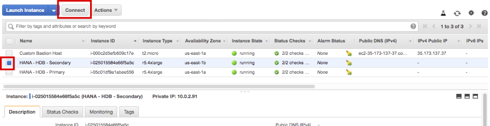
8. **Session Manager** 를 선택하고, **Connect** 버튼을 누릅니다. Session Manager를 통해 **sechana** 인스턴스에 접속합니다.
    
9. Cluster의 상태를 체크 합니다.
    * **crm_mon** 은 Cluster의 현재 상태를 제공하는 명령어 입니다.(root 유저사용)
    * 아래 명령어를 수행하여 **sechana** 가 **Master** 상태인지 확인 합니다. 이전 Case와 다르게 **prihana** 가 **OFFLINE** 상태 입니다.
    ```shell
    sudo su -
    crm_mon -rfn1
    ```
    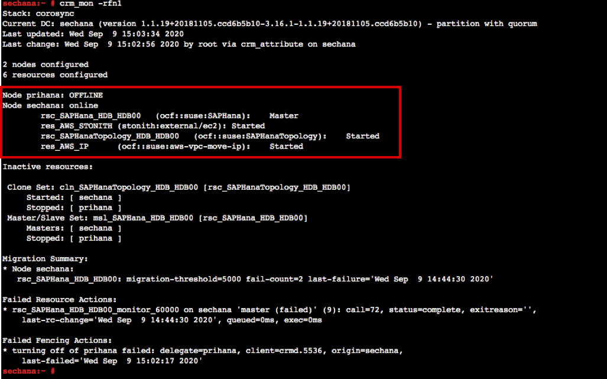
10. SAP HANA System Replication (HSR) 상태 체크를 합니다.
    * **SAPHanaSR-showAttr** 수행 결과 이전과 달리 **prihana** node가 **offline** 상태 입니다.(root 유저사용)
    ```shell
    SAPHanaSR-showAttr
    ```
    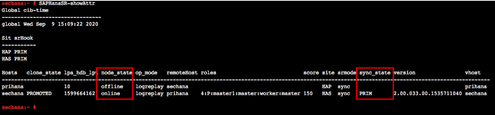
11. Take over 후 resource 상태를 cleaned up 해줍니다.(root 유저사용)
    ```shell
    crm resource cleanup rsc_SAPHanaTopology_HDB_HDB00
    ```
    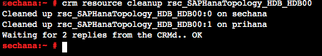
12. Bastion Host에 접속해서 HAWK 웹의 Dashboard를 확인합니다(Lab02 참고)
    * 이전 Case와 다르게 **prihana** 가 offline 상태 입니다.
    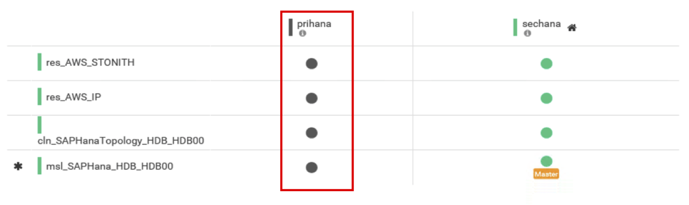
13. [EC2 Instance Console](https://console.aws.amazon.com/ec2/v2/home?region=us-east-1#Instances:sort=instanceId)에 접속 합니다.
14. **HANA-HDB-Primary** 인스턴스가 **stopped** 상태 입니다. **prihana** 를 **Start** 하여 정상 상태인지 확인합니다.
    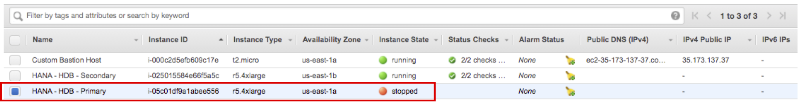
15. **HANA-HDB-Primary** 인스턴스를 선택하고, **Action** 버튼을 누릅니다. **Instance State** 에서 **Start** 를 누릅니다. **Yes, Start** 버튼을 누릅니다.
    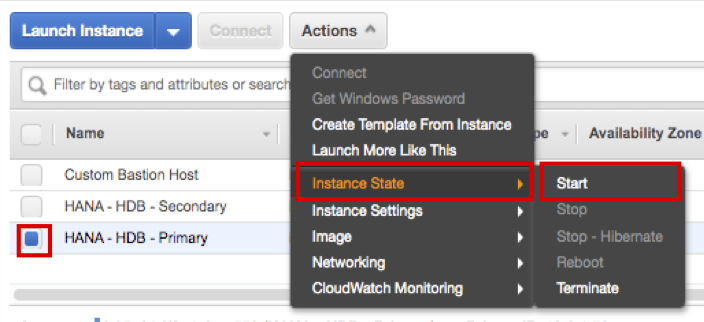
16. **HANA-HDB-Primary** 정상적으로 부팅이 되면, **sechana** 인스턴스에 접속하여, Cluster 및 HSR 상태를 확인 합니다.
17. Cluster의 상태를 체크 합니다.
    * 아래 명령어를 수행하여 **prihana** 가 **Slave** 상태인지 확인 합니다.(root 유저사용)
    ```shell
    sudo su -
    crm_mon -rfn1
    ```
    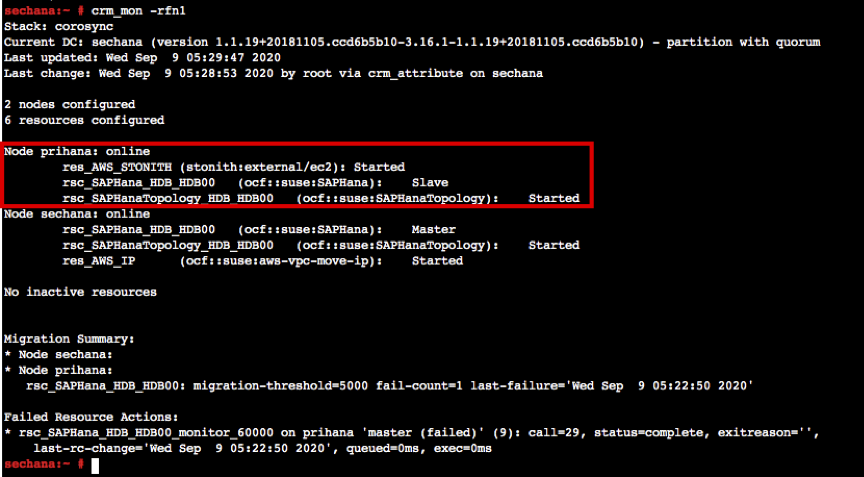
18. SAP HANA System Replication (HSR) 상태 체크를 합니다.
    * **SAPHanaSR-showAttr** 사용하여 **prihana** node가 **SOK** 확인 합니다.(root 유저사용)
    ```shell
    SAPHanaSR-showAttr
    ```
    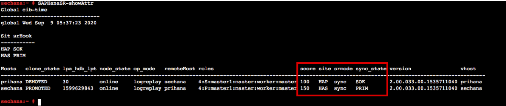
19. resource 상태를 cleaned up 해줍니다.(root 유저사용)
    ```shell
    crm resource cleanup rsc_SAPHanaTopology_HDB_HDB00
    ```
    
20. Bastion Host에 접속해서 HAWK 웹의 Dashboard를 확인합니다(Lab02 참고)
    *  **prihana** 가 online 상태로 변한것을 확인하실 수 있습니다.
    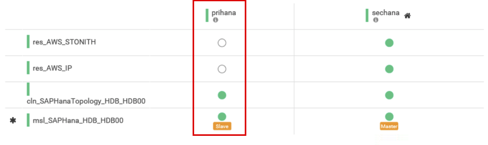

---

### Crash Secondary Site Node (sechana)
Primary node인 **sechana** 에서 System Crash가 발생 했을 때, Secondary node **prihana** 노드가 Primary node로 정상적으로 전환되는지 확인.
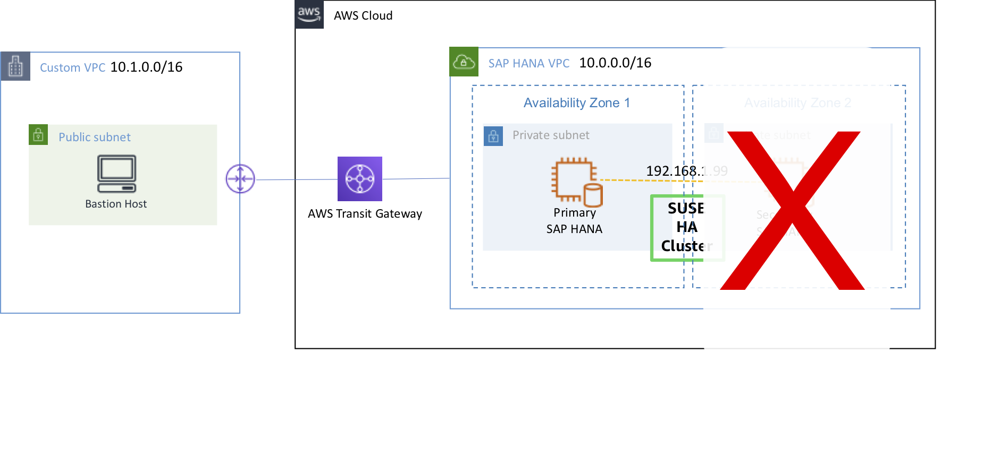

1. [EC2 Instance Console](https://console.aws.amazon.com/ec2/v2/home?region=us-east-1#Instances:sort=instanceId)에 접속 합니다.
2. **HANA-HDB-Secondary** 인스턴스를 선택하고, **Connect** 버튼을 누릅니다.
    
3. **Session Manager** 를 선택하고, **Connect** 버튼을 누릅니다. Session Manager를 통해 **sechana** 인스턴스에 접속합니다.
    
4. **sechana** 에서 fast-reboot을 수행합니다.(root 유저사용)
    ```shell
    sudo su -
    echo 'b' > /proc/sysrq-trigger
    ```
    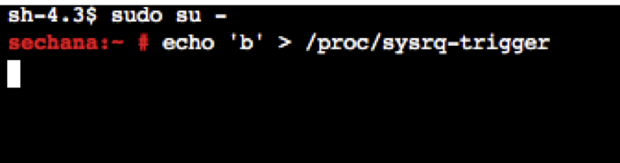

5. **prihana** 에 들어가서 Cluster 및 HSR 상태를 확인합니다.
6. [EC2 Instance Console](https://console.aws.amazon.com/ec2/v2/home?region=us-east-1#Instances:sort=instanceId)에 접속 합니다.
7. **HANA-HDB-Primary** 인스턴스를 선택하고, **Connect** 버튼을 누릅니다.
    
8. **Session Manager** 를 선택하고, **Connect** 버튼을 누릅니다. Session Manager를 통해 **prihana** 인스턴스에 접속합니다.
    
9. Cluster의 상태를 체크 합니다.
    * **crm_mon** 은 Cluster의 현재 상태를 제공하는 명령어 입니다.(root 유저사용)
    * 아래 명령어를 수행하여 **prihana** 가 **Master** 상태인지 확인 합니다. 이전 Case와 다르게 **sechana** 가 **OFFLINE** 상태 입니다.
    ```shell
    sudo su -
    crm_mon -rfn1
    ```
    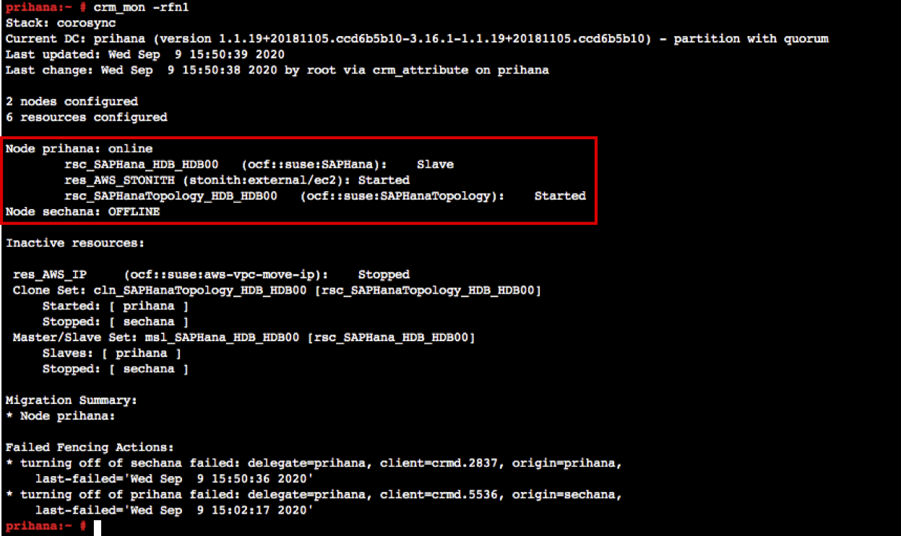
10. SAP HANA System Replication (HSR) 상태 체크를 합니다.
    * **SAPHanaSR-showAttr** 수행 결과 이전과 달리 **sechana** node가 **offline** 상태 입니다.(root 유저사용)
    ```shell
    SAPHanaSR-showAttr
    ```
    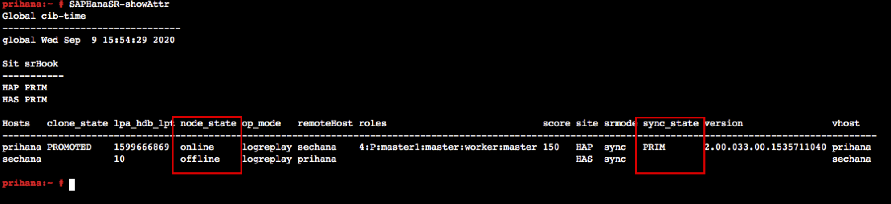
11. Take over 후 resource 상태를 cleaned up 해줍니다.(root 유저사용)
    ```shell
    crm resource cleanup rsc_SAPHanaTopology_HDB_HDB00
    ```
    
12. Bastion Host에 접속해서 HAWK 웹의 Dashboard를 확인합니다(Lab02 참고)
    * 이전 Case와 다르게 **sechana** 가 offline 상태 입니다.
    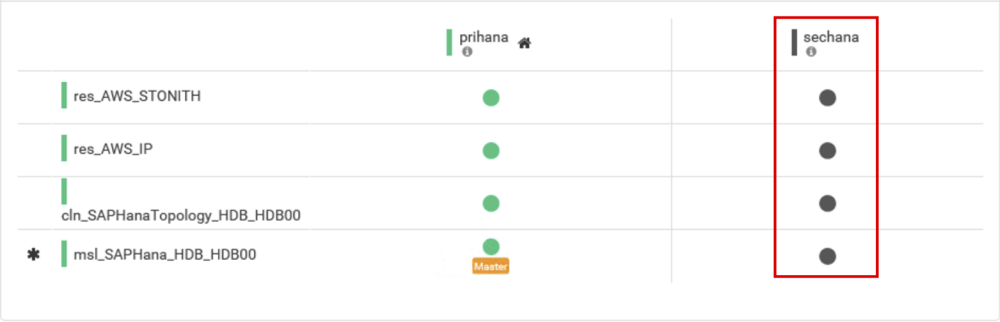
13. [EC2 Instance Console](https://console.aws.amazon.com/ec2/v2/home?region=us-east-1#Instances:sort=instanceId)에 접속 합니다.
14. **HANA-HDB-Secondary** 인스턴스가 **stopped** 상태 입니다. **sechana** 를 **Start** 하여 정상 상태인지 확인합니다.
    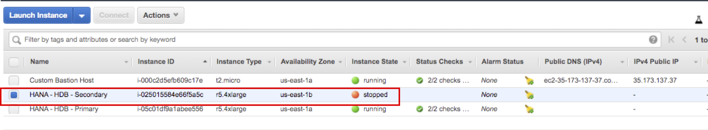
15. **HANA-HDB-Secondary** 인스턴스를 선택하고, **Action** 버튼을 누릅니다. **Instance State** 에서 **Start** 를 누릅니다. **Yes, Start** 버튼을 누릅니다.
    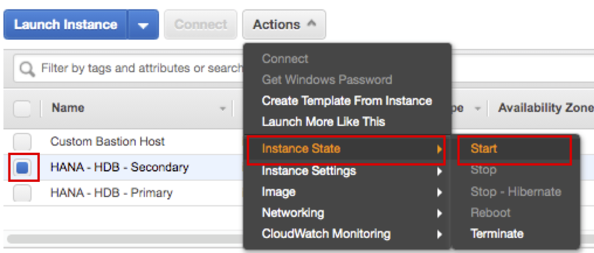
16. **HANA-HDB-Secondary** 정상적으로 부팅이 되면, **prihana** 인스턴스에 접속하여, Cluster 및 HSR 상태를 확인 합니다.
17. Cluster의 상태를 체크 합니다.
    * 아래 명령어를 수행하여 **sechana** 가 **Slave** 상태인지 확인 합니다.(root 유저사용)
    ```shell
    sudo su -
    crm_mon -rfn1
    ```
    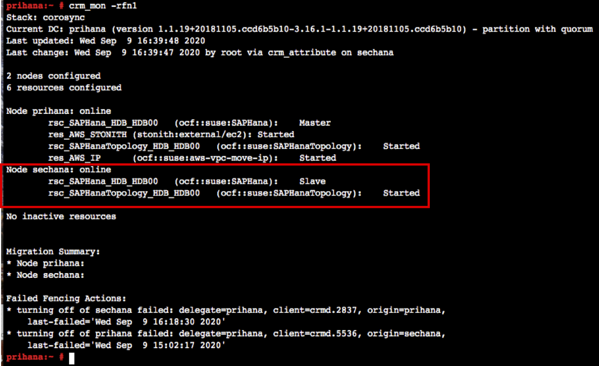
18. SAP HANA System Replication (HSR) 상태 체크를 합니다.
    * **SAPHanaSR-showAttr** 사용하여 **sechana** node가 **SOK** 확인 합니다.(root 유저사용)
    ```shell
    SAPHanaSR-showAttr
    ```
    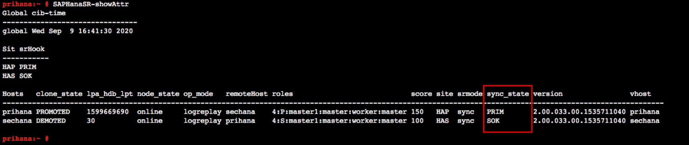
19. resource 상태를 cleaned up 해줍니다.(root 유저사용)
    ```shell
    crm resource cleanup rsc_SAPHanaTopology_HDB_HDB00
    ```
    
20. Bastion Host에 접속해서 HAWK 웹의 Dashboard를 확인합니다(Lab02 참고)
    *  **sechana** 가 online 상태로 변한것을 확인하실 수 있습니다.
    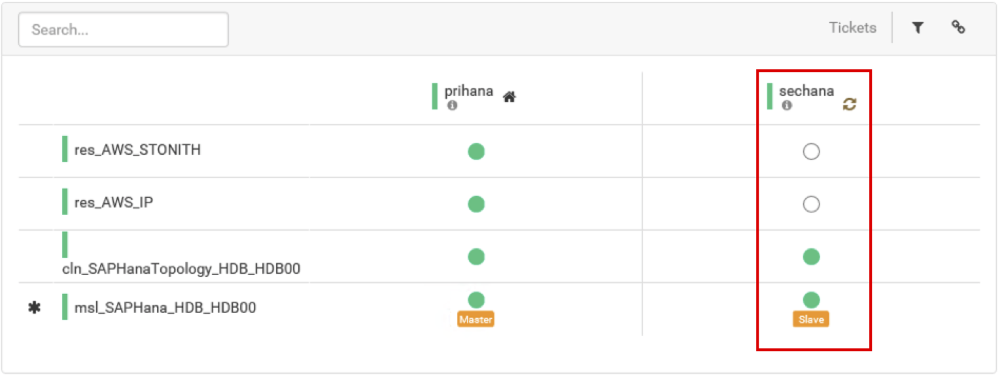

---

{}
***Lab03 실습이 종료 되었습니다. 다음은 Demo.Config Cost Optimized Scenario를 진행합니다.***
{}

---

<p align="center">
© 2019 Amazon Web Services, Inc. 또는 자회사, All rights reserved.
</p>
