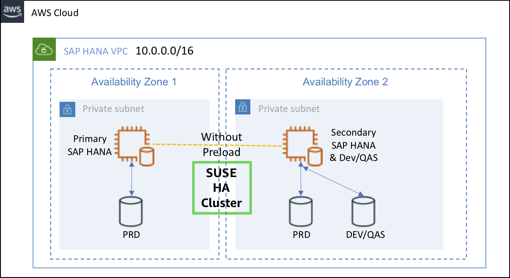

#### Demo 설명
{}
***QuickStart로 설치된 Performance Optimized Scenario의 SAP HANA DB의 HA 설정을 변경하여 Standby와 QAS 시스템이 같이 있는 Cost Optimized 형태로 구성할 예정입니다. 설정과 관련된 자세한 사항은 아래 링크를 참고하시기 바랍니다***
{}

* [SAP HANA High Availability Cluster for the AWS Cloud - Setup Guide](https://documentation.suse.com/sbp/all/html/SLES4SAP-hana-sr-guide-PerfOpt-12_AWS/index.html)

---

#### Demo Architecture

---

© 2019 Amazon Web Services, Inc. 또는 자회사, All rights reserved.

