{}
Task 01에서는 Standby 시스템에서 QAS 시스템 서비스를 위해 HSR 옵션을 변경하고. Global Memory 설정을 변경할 예정입니다.
{}

---

1. Session Manager를 통해 sechana에 접속합니다.
    * AWS Management Console에 로그인 한 뒤 [EC2 Instance Console](https://console.aws.amazon.com/ec2/v2/home?region=us-east-1#Instances:sort=instanceId)에 접속 합니다.
    * **HANA-HDB-Secondary** 인스턴스를 선택하고, **Action**을 선택하고, **Connect**을 선택 합니다.
    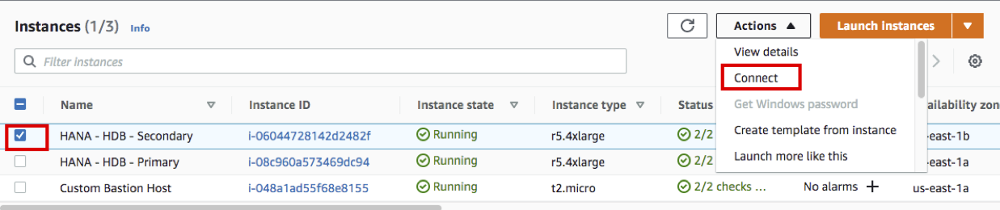
    * **Session Manager** 를 선택하고, **Connect** 버튼을 누릅니다.
    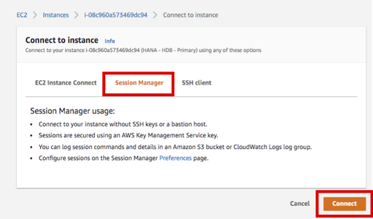

2. root 유저로 접속 후, Cluster를 Maintenance 모드로 변경하고, HSR 및 Global Memory 설정을 변경합니다
    * Cluster를 Maintenance 모드로 변경 합니다.
    ```shell
    sudo su - root
    crm node maintenance prihana
    crm node maintenance sechana
    ```

    * crm maintenance 상태 확인
    ```shell
    crm_mon -rfn1
    ```
    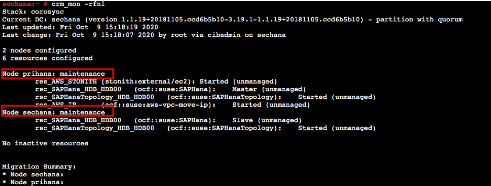


3. hdbadm 유저로 접속 후, HDB Stop 하고, Secondary 운영 SAP HANA DB (HDB)의 메모리 자원 사용을 줄이고 preload 옵션 false로 설정합니다.
    * (sechana) HDB STOP
    ```shell
    su - hdbadm
    HDB stop
    ```
    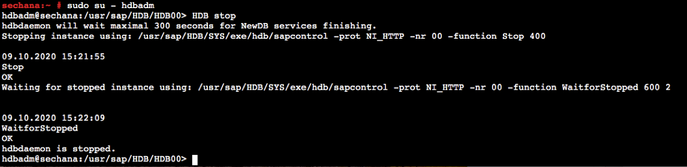

    * (sechana) global.ini 설정을 변경합니다. VI 편집기로 global.ini 를 오픈 합니다. 그리고 아래 옵션을 추가 합니다.
    ```shell
    vi /usr/sap/HDB/SYS/global/hdb/custom/config/global.ini

    [system_replication]
    ...
    preload_column_tables = false #Add-on

    [memorymanager]
    global_allocation_limit = 24576
    ```
    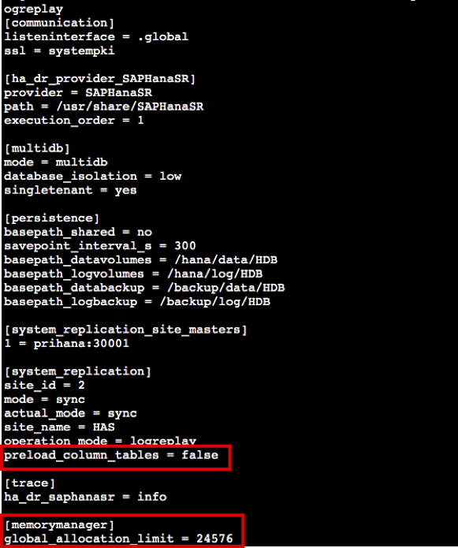

4. Takover 이후에는 해당 설정이 원복 할 수 있도록, SAPHanaSR-Hook 변경 합니다.
    * (sechana) root user 접속 후, SAPHanaSR.py 수정하기 전에 스크립트를 백업 합니다.
    ```shell
    exit
    cd /usr/share/SAPHanaSR/
    cp -pr SAPHanaSR.py SAPHanaSR.py.default
    ```
    * (sechana) root user 접속 후, SAPHanaSR.py 스크립트를 아래와 같이 2가지를 수정 합니다.
      * 수정 1(AS-Is)
      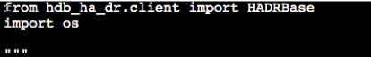
      * 수정 1(To-Be)
      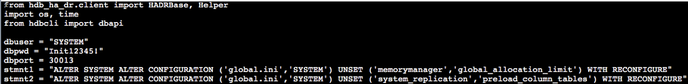
      * 수정 2(AS-Is)
      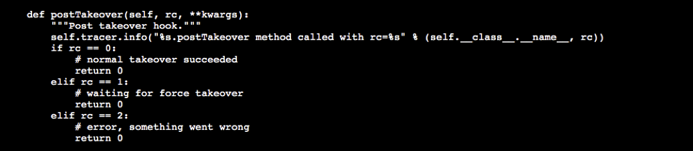
      * 수정 2(To-Be)
      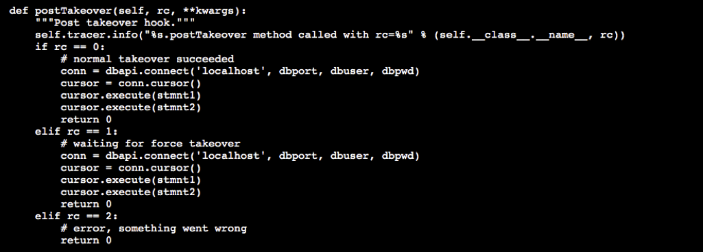
      * 스크립트는 아래와 같이 수정하시기 바랍니다.
      ```shell
      vi SAPHanaSR.py

      # 수정 1
      from hdb_ha_dr.client import HADRBase, Helper
      import os, time
      from hdbcli import dbapi

      dbuser = "SYSTEM"
      dbpwd = "Init12345!"
      dbport = 30013
      stmnt1 = "ALTER SYSTEM ALTER CONFIGURATION ('global.ini','SYSTEM') UNSET ('memorymanager','global_allocation_limit') WITH RECONFIGURE"
      stmnt2 = "ALTER SYSTEM ALTER CONFIGURATION ('global.ini','SYSTEM') UNSET ('system_replication','preload_column_tables') WITH RECONFIGURE"

      # 수정 2
      def postTakeover(self, rc, **kwargs):
      """Post takeover hook."""
      self.tracer.info("%s.postTakeover method called with rc=%s" % (self.__class__.__name__, rc))
      if rc == 0:
        # normal takeover succeeded
        conn = dbapi.connect('localhost', dbport, dbuser, dbpwd)
        cursor = conn.cursor()
        cursor.execute(stmnt1)
        cursor.execute(stmnt2)
        return 0
      elif rc == 1:
        # waiting for force takeover
        conn = dbapi.connect('localhost', dbport, dbuser, dbpwd)
        cursor = conn.cursor()
        cursor.execute(stmnt1)
        cursor.execute(stmnt2)
        return 0
      elif rc == 2:
        # error, something went wrong
        return 0
      ```

5. hdbadm 유저로 접속 후, HDB Start 하고, TAKEOVER TEST 를 수행합니다.
    * (sechana)의 Secondary HDB START
    ```shell
    su - hdbadm
    HDB start
    ```
    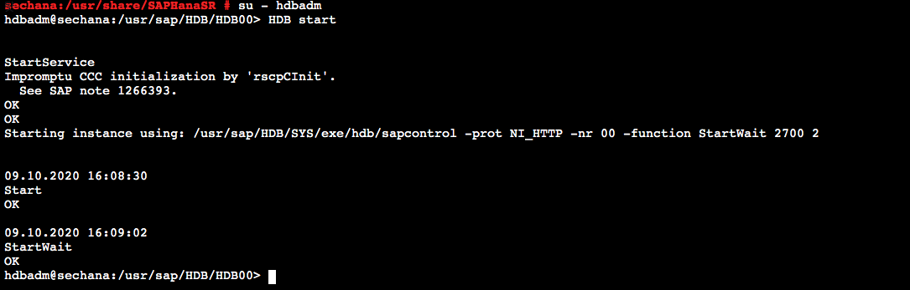

    * (sechana)에서 HSR 상태를 확인합니다.
    ```shell
    hdbnsutil -sr_state
    ```
    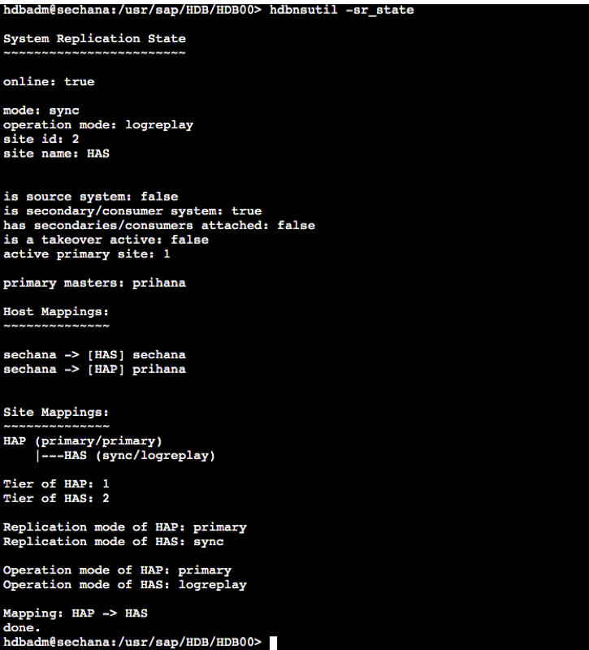

    * (sechana)에서 Takeover를 수행합니다
    ```shell
    hdbnsutil -sr_takeover
    ```
    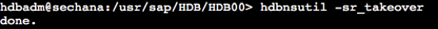

    * (sechana)에서 SAPHanaSR.py 에 의해 Takeover 후 global.ini 설정이 원복 되었는지 확인 합니다.
    ```shell
    cat /usr/sap/HDB/SYS/global/hdb/custom/config/global.ini
    ```
    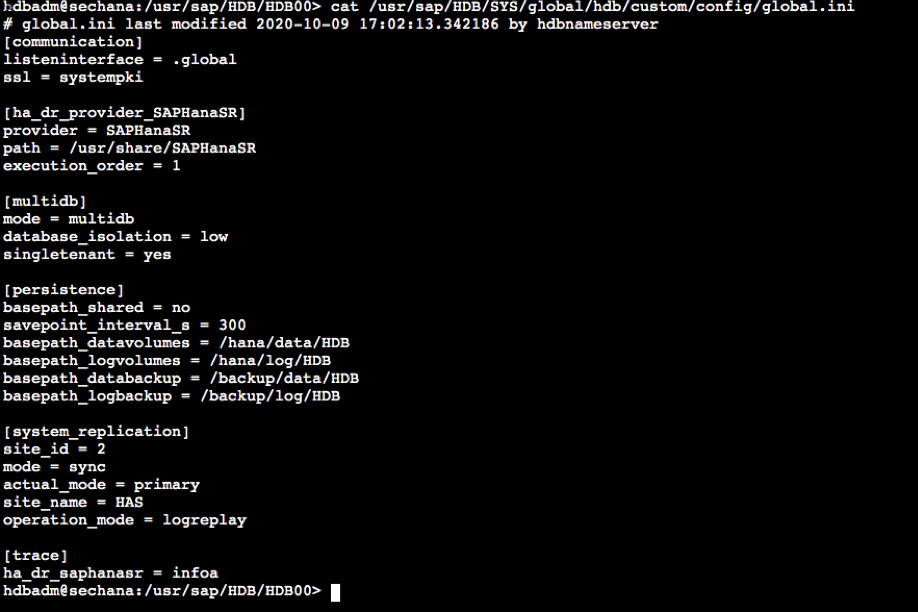

    * 현재 HA Cluster가 maintenance mode이므로 HA Cluster를 사용한 자동 Takeover-Takeback이 불가능한 상태이므로 SAP HANA SR을 원래 상태로 복원하기 위해 아래와 같은 순서로 수작업으로 재설정한다.
    * sechana 연결은 유지하고, Session Manager를 통해 prihana도 접속합니다.
        * AWS Management Console에 로그인 한 뒤 [EC2 Instance Console](https://console.aws.amazon.com/ec2/v2/home?region=us-east-1#Instances:sort=instanceId)에 접속 합니다.
        * **HANA-HDB-Primary** 인스턴스를 선택하고, **Action**을 선택하고, **Connect**을 선택 합니다.
        
        * **Session Manager** 를 선택하고, **Connect** 버튼을 누릅니다. 
        
    * (prihana)에서 hdbadm 유저로 접속 후, REGISTER as seconadry Database 수행
    ```shell
    sudo su - hdbadm
    HDB stop

    hdbnsutil -sr_register --remoteHost=sechana --remoteInstance=00 --replicationMode=sync --name=HAP --operationMode=logreplay
    HDB start
    ```
    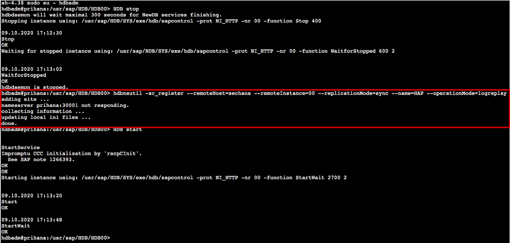

    * (prihana)에서 동기화 상태 확태 확인
    ```shell
    hdbnsutil -sr_state
    ```
    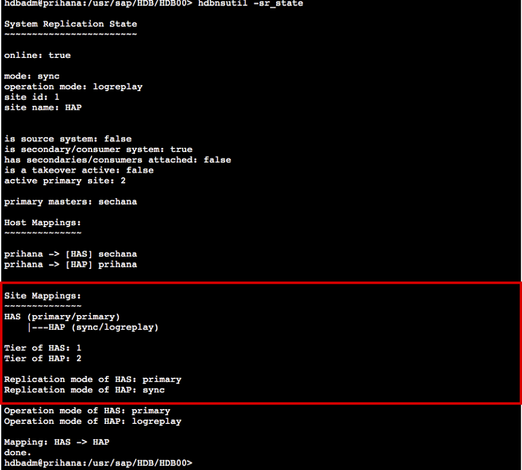

    * (prihana)에서 takeback
    ```shell
    hdbnsutil -sr_takeover
    ```
    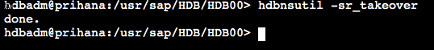

    * (sechana)에서 hdbadm 유저로 접속 후, REGISTER as seconadry Database 수행
    ```shell
    su - hdbadm
    HDB stop

    hdbnsutil -sr_register --remoteHost=prihana --remoteInstance=00 --replicationMode=sync --name=HAS --operationMode=logreplay
    ```
    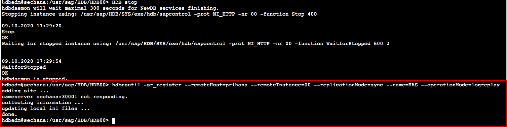

    * (sechana)의 global.ini 설정을 변경합니다. VI 편집기로 global.ini 를 오픈 합니다. 그리고 아래 옵션을 추가 합니다.
    ```shell
    vi /usr/sap/HDB/SYS/global/hdb/custom/config/global.ini

    [system_replication]
    ...
    preload_column_tables = false #Add-on

    [memorymanager]
    global_allocation_limit = 24576
    ```
    

    * (sechana)에서 HDB START
    * (sechana)에서 hdbadm 유저로 접속 후, Secondary HDB START
    ```shell
    HDB start
    ```
    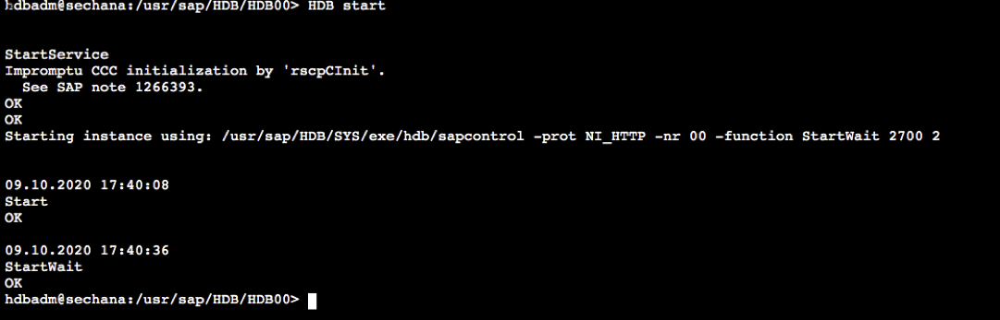

---
<p align="center">
© 2019 Amazon Web Services, Inc. 또는 자회사, All rights reserved.
</p>
