{}
Task 02에서는 QAS(Non-productive) SAP HANA 데이터베이스를 sechana에 설치합니다.
본 실습에서는 최소한의 기능 검증만을 위한 설치를 진행 할 예정입니다. HANA DB의 설치와 관련된 상세한 내용은 아래 SAP HANA Administration Guide를 참조 하시기 바랍니다.
{}

* [SAP HANA Administration Guide](https://help.sap.com/doc/eb75509ab0fd1014a2c6ba9b6d252832/2.0.03/en-US/SAP_HANA_Administration_Guide_en.pdf)

---
1. Session Manager를 통해 sechana에 접속합니다.
    * AWS Management Console에 로그인 한 뒤 [EC2 Instance Console](https://console.aws.amazon.com/ec2/v2/home?region=us-east-1#Instances:sort=instanceId)에 접속 합니다.
    * **HANA-HDB-Secondary** 인스턴스를 선택하고, **Action**을 선택하고, **Connect**을 선택 합니다.
    
    * **Session Manager** 를 선택하고, **Connect** 버튼을 누릅니다.
    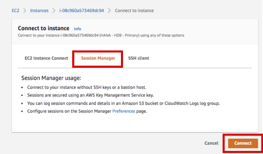

2. HANA 설치 파일을 S3로 부터 다운 받기 위해 awscli 를 설치합니다.
    * 자세한 설치 방법은 옆 링크를 참고 하시기 바랍니다. [Install the AWS CLI version 2 on Linux](https://docs.aws.amazon.com/cli/latest/userguide/install-cliv2-linux.html)
    * root 유저로 접속 후, 최신 버전의 AWS CLI를 아래와 같이 설치 합니다
    ```shell
    sudo su -
    cd /hana/shared
    curl "https://awscli.amazonaws.com/awscli-exe-linux-x86_64.zip" -o "awscliv2.zip"
    unzip awscliv2.zip
    ./aws/install
    ```
    * aws cli 설치를 아래와 같이 확인 합니다
    ```shell
    aws --version
    ```
    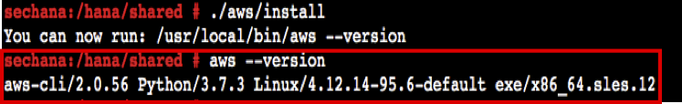

3. HANA 설치 파일을 아래와 같이 다운 받은 후 압축을 해제 합니다.
    * 실습 가이드에서 공유 받은 S3 URL로 부터 설치 파일을 다운 받습니다.(e.g s3://sap-immsersionday-hol1/hanadb)
    ```shell
    mkdir -p /hana/shared/hanadb
    cd /hana/shared/hanadb
    aws s3 cp s3://sap-immsersionday-hol1/hanadb . --recursive

    ```
    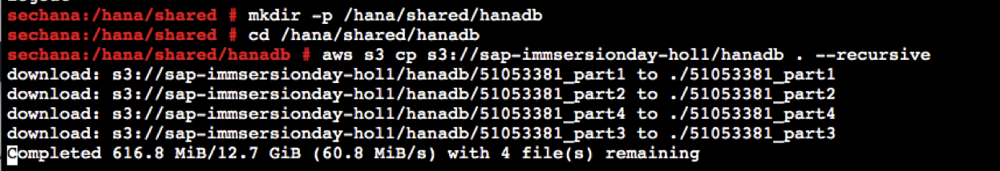   

   * HANA 설치 파일 압축을 아래와 같이 해제 합니다.  
   ```shell
   unrar x 51053381_part1.exe
   ```
   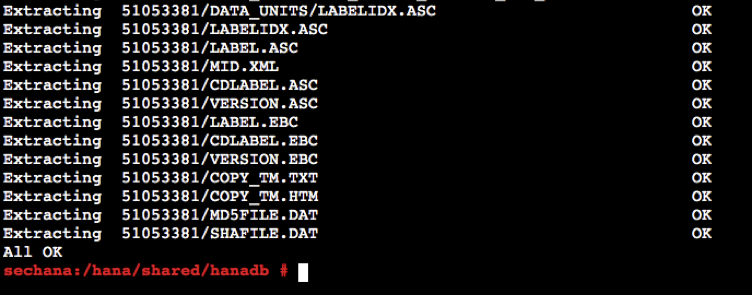

4. HANA DB를 설치 합니다.
   * 주요 설치 옵션은 아래와 같습니다.
      * System ID : **QAS**
      * Instance Number : **10**
      * Master Password : **Init12345!**
      * Restrict maximum memory allocation : **y**
      * Enter Maximum Memory Allocation in MB [63615]: **32768**

   * hdblcm 을 사용해서 HANA DB를 설치 합니다.
   ```shell
   cd /hana/shared/hanadb/51053381/DATA_UNITS/HDB_LCM_LINUX_X86_64
   ./hdblcm
   ```

   * 설치 옵션을 아래와 같이 입력 합니다.
     * choose an action[install] : 2
     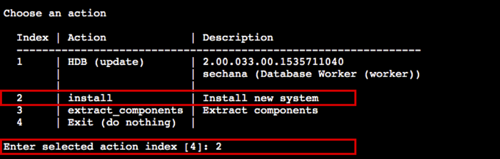
     * Select additional components for installation[server] : 2
     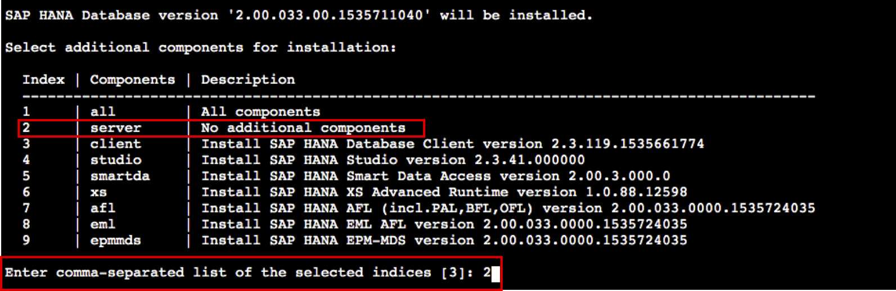
     * Install Path와, Host Name 등은 Default 설정을 사용하고, System ID는 **QAS**, Instance Number는 **10** 으로 입력합니다.
     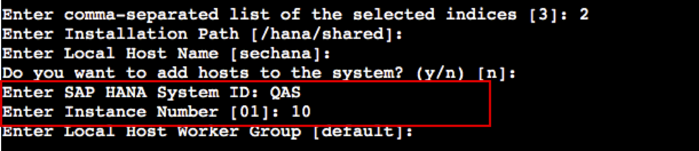
     * System usage는 test로 **2** 선택합니다, memory 설정을 **32769** MB 및 패스워드를 **Init12345!** 입력하고 나머지는 Default 설정을 사용합니다.
     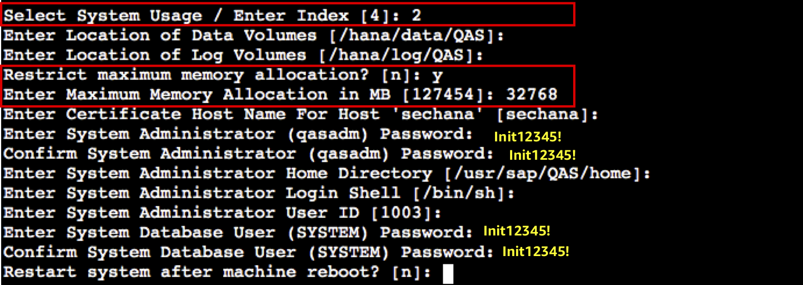
     * Do you want to continue? (y/n) **y** 로 입력합니다.
     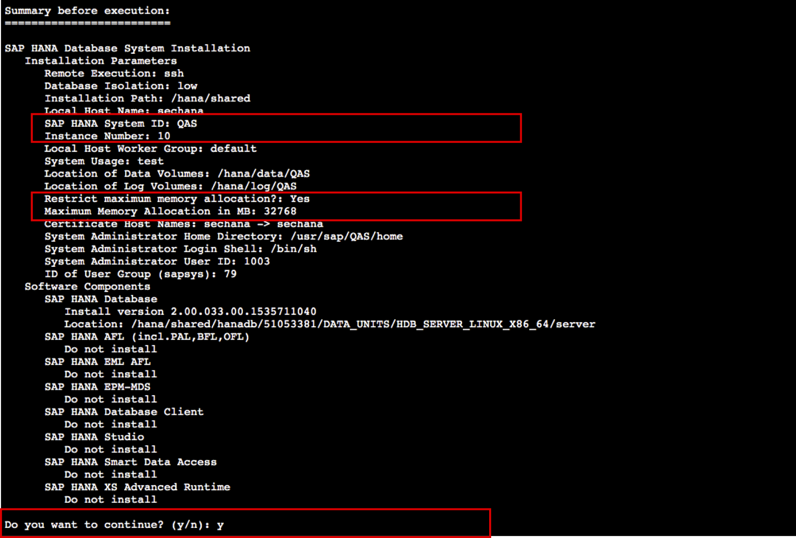

   * 설치가 완료되면 아래와 같은 결과를 확인하실 수 있습니다.
    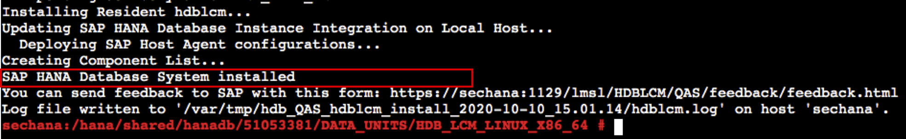

5. QAS HANA DB 설치를 확인 합니다.
   * qasadm 유저로 스위치 하고, HDB 인스턴스가 정상적으로 기동 중인지 확인 합니다.
   ```shell
   su - qasadm
   HDB info
   ```
   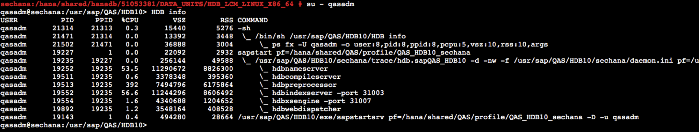


---
<p align="center">
© 2019 Amazon Web Services, Inc. 또는 자회사, All rights reserved.
</p>
