{}
Task 03에서는 기존 Cluster 구성을 변경하여 기존 HANA Database와 새로 추가된 QAS HANA Database를 관리할 수 있도록 변경할 것입니다.
{}

* Cost Optimized 시나리오 변경을 위해서는 아래와 같이 Cluster의 HANA DB 리소스에 대한 **PREFER_SITE_TAKEOVER** 옵션 변경이 필요합니다. 자세한 사항은 아래 링크를 참고하시기 바랍니다.
  * [SAP HANA High Availability Cluster for the AWS Cloud - Setup Guide](https://documentation.suse.com/sbp/all/html/SLES4SAP-hana-sr-guide-PerfOpt-12_AWS/index.html)
  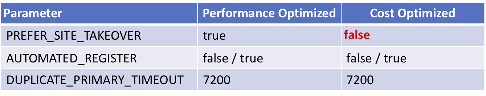


---

1. Cluster 설정을 위해 sechana, prihana 노드의 DB 모두 stop 합니다.
    * Session Manager를 통해 sechana에 접속합니다.
      * AWS Management Console에 로그인 한 뒤 [EC2 Instance Console](https://console.aws.amazon.com/ec2/v2/home?region=us-east-1#Instances:sort=instanceId)에 접속 합니다.
      * **HANA-HDB-Secondary** 인스턴스를 선택하고, **Action**을 선택하고, **Connect**을 선택 합니다.
      
      * **Session Manager** 를 선택하고, **Connect** 버튼을 누릅니다.
      

      * QAS DB를 Stop 합니다.
      ```shell
      sudo su - qasadm
      HDB stop
      exit
      ```
      

      * HDB DB를 Stop 합니다.
      ```shell
      sudo su - hdbadm
      HDB stop
      exit
      ```
      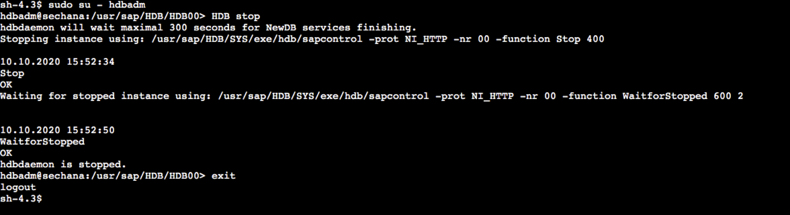


    * sechana 접속을 유지하고, Session Manager를 통해 prihana에 접속합니다.
      * AWS Management Console에 로그인 한 뒤 [EC2 Instance Console](https://console.aws.amazon.com/ec2/v2/home?region=us-east-1#Instances:sort=instanceId)에 접속 합니다.
      * **HANA-HDB-Primary** 인스턴스를 선택하고, **Action**을 선택하고, **Connect**을 선택 합니다.
      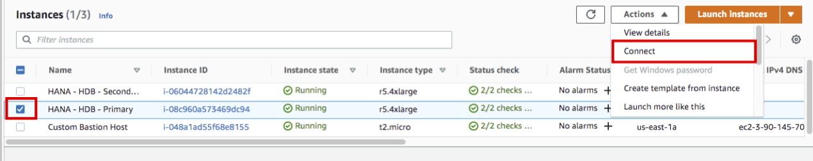
      * **Session Manager** 를 선택하고, **Connect** 버튼을 누릅니다.
      
      * HDB DB를 Stop 합니다.
      ```shell
      sudo su - hdbadm
      HDB stop
      exit
      ```
      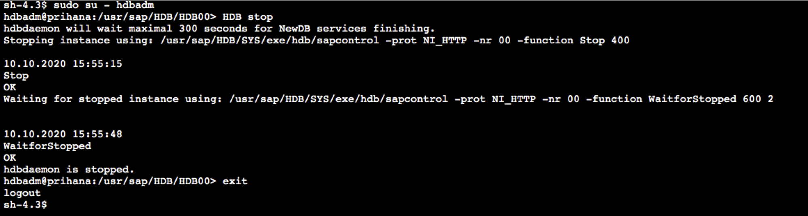

2. prihana에서 root 유저로, Cluster 의 HANA DB 리소스에 대한 **PREFER_SITE_TAKEOVER** 옵션을 **true** 에서 **false**로 변경합니다.
    * prihana의 유저를 root로 스위치 후, 스니펫 생성을 위한 폴더를 생성 합니다
    ```shell
    sudo su -
    mkdir -p /hana/shared/script/
    cd /hana/shared/script/
    ```

    * VI 편집기를 이용하여, 아래와 같이 스니펫 생성을 생성 합니다.
    ```shell
    vi crm-SAPHana-update.txt

    primitive rsc_SAPHana_HDB_HDB00 ocf:suse:SAPHana \
        operations $id=rsc_sap_HDB_HDB00-operations \
        op start interval=0 timeout=3600 \
        op stop interval=0 timeout=3600 \
        op promote interval=0 timeout=3600 \
        op monitor interval=60 role=Master timeout=700 \
        op monitor interval=61 role=Slave timeout=700 \
        params SID=HDB InstanceNumber=00 PREFER_SITE_TAKEOVER=false DUPLICATE_PRIMARY_TIMEOUT=7200 AUTOMATED_REGISTER=true
    ```
    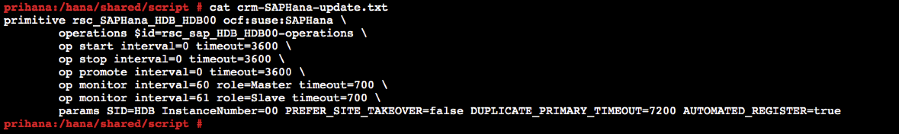

    * 생성한 스니펫을 crm에 반영 합니다.
    ```shell
    crm configure load update crm-SAPHana-update.txt
    ```

    * 업데이트 된 crm 설정을 확인 합니다.
    ```shell
    crm config show
    ```
    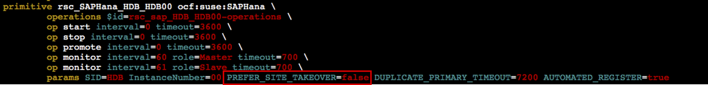

3. prihana에서 root 유저로, Cluster에 QAS HANA DB를 위한 리소스를 등록 합니다.
    * VI 편집기를 이용하여, 아래와 같이 스니펫 생성을 생성 합니다.
    ```shell
    vi crm-qas.txt

    primitive rsc_SAP_QAS_HDB10 ocf:heartbeat:SAPDatabase \
      params DBTYPE="HDB" SID="QAS" InstanceNumber="10" \
      MONITOR_SERVICES="hdbindexserver|hdbnameserver" \
      op start interval="0" timeout="600" \
      op monitor interval="120" timeout="700" \
      op stop interval="0" timeout="300" \
      meta priority="100"
    ```
    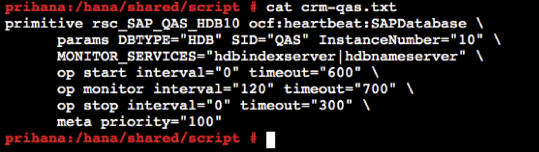

    * 생성한 스니펫을 crm에 반영 합니다.
    ```shell
    crm configure load update crm-qas.txt
    ```
    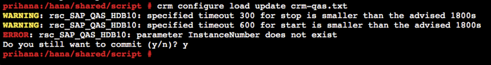

4. prihana에서 root 유저로, 새로 생성한 QAS HANA DB 리소스 제약사항을 설정 합니다.
    * VI 편집기를 이용하여, 아래와 같이 스니펫 생성을 생성 합니다.
    ```shell
    vi crm-cs-qas.txt

    location loc_QAS_never_on_prihana rsc_SAP_QAS_HDB10 -inf: prihana
    colocation col_QAS_never_with_AWS_IP -inf: rsc_SAP_QAS_HDB10:Started \
    res_AWS_IP
    order ord_QASstop_before_HDB-promote inf: rsc_SAP_QAS_HDB10:stop \
    msl_SAPHana_HDB_HDB00:promote
    ```
    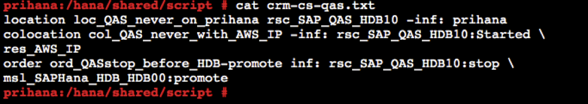

    * 생성한 스니펫을 crm에 반영 합니다.
    ```shell
    crm configure load update crm-cs-qas.txt
    ```

    * 업데이트 된 crm 설정을 확인 합니다.
    ```shell
    crm config show
    ```
    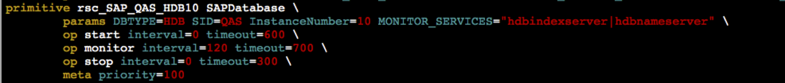
    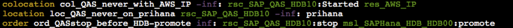

5. prihana에서 root 유저로, Cluster Maintenance 모드를 해제하고 정상적으로 설정 되었는지를 모니터링 합니다.
    * Cluster Maintenance 모드를 해제합니다.
    ```shell
    crm node ready prihana
    crm node ready sechana
    ```

    * Cluster 상태를 모니터링 합니다. QAS HANA DB 리소스가 정상적으로 **Started** 되었는지 확인 합니다.
    ```shell
    crm_mon -rfn1
    ```
    

    * HSR 상태를 모니터링 합니다. sechana의 status가 **SOK** 상태인지 확인 합니다.
    ```shell
    SAPHanaSR-showAttr
    ```
    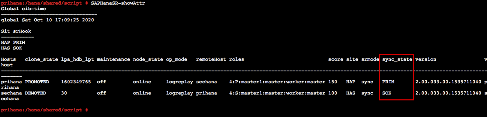

6. sechana에서 qasadm 유저로, QAS HANA DB가 정상적으로 기동 되었는지 확인 합니다.
    * HDB process 들이 정상적으로 기동 되었는지 확인 합니다.  
    ```shell
    sudo su - qasadm
    HDB info
    ```
    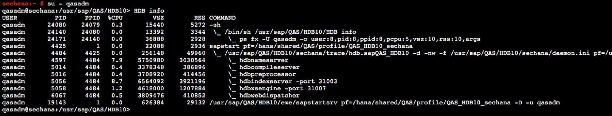


---
<p align="center">
© 2019 Amazon Web Services, Inc. 또는 자회사, All rights reserved.
</p>
