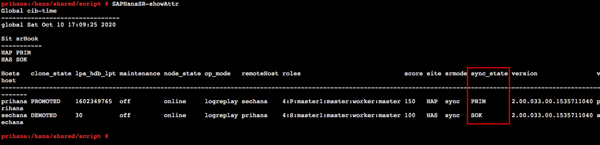

{}
Task 04에서는 설정은 변경 한 Cluster를 테스트하여 시나리오에 따라 정상 동작 하는지 확인합니다.
{}

---

1. 첫번째 시나리오는 prihana의 DB를 crash 했을 때, Cluster가 어떻게 동작 하는지 확인 합니다.
  * Session Manager를 통해 prihana에 접속합니다.
    * AWS Management Console에 로그인 한 뒤 [EC2 Instance Console](https://console.aws.amazon.com/ec2/v2/home?region=us-east-1#Instances:sort=instanceId)에 접속 합니다.
    * **HANA-HDB-Primary** 인스턴스를 선택하고, **Action**을 선택하고, **Connect**을 선택 합니다.
    
    * **Session Manager** 를 선택하고, **Connect** 버튼을 누릅니다.
    

    * hdbadm 유저로 스위치 합니다. HDB DB를 Kill 합니다.
    ```shell
    sudo su - hdbadm
    HDB kill -9
    exit
    ```
    

    * root 유저로 스위치 합니다. Cluster 상태를 모니터링 합니다. 리소스 상태가 어떻게 변했는지 확인 합니다.
    ```shell
    sudo su -
    crm_mon -rfn1
    ```
    

    * HSR 상태를 모니터링 합니다. sechana의 status가 **SOK** 상태인지 확인 합니다.
    ```shell
    SAPHanaSR-showAttr
    ```
    

    * OS가 정상 상태이고, **PREFER_SITE_TAKEOVER** 옵션을 **false**로 변경 하였기 때문에 Take over 되지 않고, prihana에서 DB가 재 기동 되었습니다.

2. 두번째 시나리오는 prihana의 OS를 crash 했을 때, Cluster가 어떻게 동작 하는지 확인 합니다.
    * prihana의 OS를 fast reboot 합니다.
    ```shell
    sudo su -
    echo 'b' > /proc/sysrq-trigger
    exit
    ```

    * Session Manager를 통해 sechana에 접속합니다.
      * AWS Management Console에 로그인 한 뒤 [EC2 Instance Console](https://console.aws.amazon.com/ec2/v2/home?region=us-east-1#Instances:sort=instanceId)에 접속 합니다.
      * **HANA-HDB-Secondary** 인스턴스를 선택하고, **Action**을 선택하고, **Connect**을 선택 합니다.
      
      * **Session Manager** 를 선택하고, **Connect** 버튼을 누릅니다.
      

    * sechana에서 Cluster 상태를 모니터링 합니다. 리소스 상태가 어떻게 변했는지 확인 합니다.
    ```shell
    sudo su -
    crm_mon -rfn
    ```
    

    * prihana 시스템이 Down 되었기 때문에, 정상적으로 **sechana로 Take Over** 되었습니다. 정상적인 서비스를 위해 **QAS 시스템을 내리고**, 메모리도 정상 서비스 할 수 있도록 **Memory limit** 설정을 해제 하였습니다.  
    ```shell
    sudo su - hdbadm
    cat /usr/sap/HDB/SYS/global/hdb/custom/config/global.ini
    ```
    

3. prihana 원복 합니다. 그리고 prihana가 정상이면, QAS 시스템 사용을 위해 Take Back을 수행합니다. sechana의 HDB의 global.ini 설정을 원복합니다.
    * prihana 인스턴스를 Start 시킵니다.
      * AWS Management Console에 로그인 한 뒤 [EC2 Instance Console](https://console.aws.amazon.com/ec2/v2/home?region=us-east-1#Instances:sort=instanceId)에 접속 합니다.
      * **HANA-HDB-Primary** 인스턴스를 선택하고, **Action** 을 선택하고, **Instance state** 에서 **Start Instance** 를 선택 합니다.
      

    * sechana에서 root 유저로 스위치 후, prihana 인스턴스가 정상적으로 기동 후 HDB HANA 리소스가 **Slave** 로 보이는지 확인합니다.  
    ```shell
    sudo su -
    crm_mon -rfn1
    ```
    

    * sechana에서, HSR 상태를 체크하여 prihana status가 **SOK** 인지 확인 합니다.
    ```shell
    SAPHanaSR-showAttr
    ```
    

    * sechana에서, prihana로 Take Back을 수행합니다. node를 **standby** 로 변경하여 리소스 모두 prihana로 옮깁니다.
    ```shell
    crm node standby sechana
    ```
    * prihana의 HDB HANA 리소스가 **Master** 로 전환되었는지 확인합니다.
    ```shell
    crm_mon -rfn1
    ```
    

    * sechana에서 hdbadm 유저로 스위치 후, VI 편집기를 이용하여 global.ini 원복 합니다.
    ```shell
    sudo su - hdbadm

    vi /usr/sap/HDB/SYS/global/hdb/custom/config/global.ini

    [system_replication]
    ...
    preload_column_tables = false #Add-on

    [memorymanager]
    global_allocation_limit = 24576
    ```
    

    * sechana에서 root 유저로 스위치 후, node를 **online** 시킵니다.
    ```shell
    sudo su -
    crm node online sechana
    ```

    * sechana의 HDB HANA 리소스가 **Slave** 로 전환되고, QAS HANA 리소스가 **Started** 되었는지 확인합니다.
    ```shell
    crm_mon -rfn1
    ```
    

    * HSR 상태를 체크하여 sechana status가 **SOK** 인지 확인 합니다.
    ```shell
    SAPHanaSR-showAttr
    ```
    


---
<p align="center">
© 2019 Amazon Web Services, Inc. 또는 자회사, All rights reserved.
</p>
